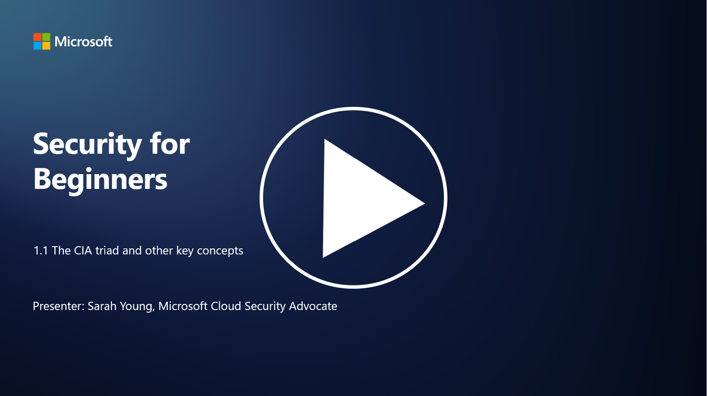

# CIA Üçlüsü ve Diğer Temel Kavramlar

## Giriş

Bu derste şunları ele alacağız:

- Siber güvenlik nedir?

- Siber güvenlikte CIA üçlüsü nedir?

- Siber güvenlik bağlamında kimlik doğrulama (authenticity), inkâr edilemezlik (nonrepudiation) ve gizlilik (privacy) nedir?

## Siber Güvenlik Nedir?

Siber güvenlik, diğer adıyla bilgi güvenliği (information security), bilgisayar sistemlerini, ağları, cihazları ve verileri dijital saldırılardan, yetkisiz erişimden, hasardan veya hırsızlıktan koruma uygulamasıdır. Siber güvenliğin temel amacı, dijital varlıkların ve bilgilerin gizliliğini (confidentiality), bütünlüğünü (integrity) ve erişilebilirliğini (availability) sağlamaktır. Siber güvenlik uzmanları, varlıkları, verileri ve bilgileri korumak için güvenlik kontrolleri tasarlar ve uygular. Hayatımızın giderek dijitalleşmesi ve çevrimiçi hale gelmesiyle birlikte, siber güvenlik hem bireyler hem de kurumlar için en önemli konulardan biri haline gelmiştir.

## Siber Güvenlikte CIA Üçlüsü Nedir?

Siber güvenlik üçlüsü, herhangi bir siber güvenlik çalışmasında veya bir sistem/çevre tasarımında dikkate alınması gereken üç ana unsuru içeren bir modeldir:

### Gizlilik (Confidentiality)

Bu, çoğu insanın "siber güvenlik" denildiğinde aklına gelen ilk unsurdur: Gizlilik, veri ve bilgilerin yetkisiz erişim girişimlerinden korunması sürecidir. Yani, yalnızca bilmesi gereken kişilerin bilgilere erişebilmesi sağlanır. Ancak tüm veriler eşit derecede önemli değildir; veriler genellikle yanlış kişilerin erişmesi durumunda ne kadar zarar verebileceğine göre sınıflandırılır ve korunur.

### Bütünlük (Integrity)

Bütünlük, bir ortamda bulunan verilerin doğruluğunu ve güvenilirliğini korumayı ifade eder. Verilerin yetkisiz kişiler tarafından değiştirilmesine veya düzenlenmesine izin verilmez. Örneğin, bir öğrencinin nüfus kayıtlarında doğum tarihini değiştirerek kendisini daha yaşlı göstermesi ve bu sayede daha erken bir doğum tarihiyle kimliğini yeniden bastırıp alkol satın alması.

### Erişilebilirlik (Availability)

Erişilebilirlik, operasyonel BT (bilgi teknolojileri) açısından önemli bir husustur, ancak siber güvenlik için de kritik bir öneme sahiptir. Güvenlik uzmanlarının, erişilebilirliği hedef alan belirli saldırılara karşı koruma sağlaması gerekir (örneğin, dağıtılmış hizmet reddi – DDoS – saldırıları).

**Siber Güvenlik CIA Üçlüsü**

## Siber Güvenlik Bağlamında Kimlik Doğrulama, İnkâr Edilemezlik ve Gizlilik Nedir?

Bunlar, sistemlerin ve verilerin güvenliğini ve güvenilirliğini sağlamaya yönelik ek önemli kavramlardır:

**Kimlik Doğrulama (Authenticity)**  
Bilgi, iletişim veya etkileşimde bulunduğunuz varlığın gerçek olduğundan ve yetkisiz taraflarca değiştirilmediğinden emin olmayı ifade eder.

**İnkâr Edilemezlik (Nonrepudiation)**  
Bir tarafın, bir işlem veya iletişimdeki katılımını veya bu işlemin/iletişimin doğruluğunu inkâr edememesini ifade eder. Bu, birinin bir mesaj göndermediğini veya belirli bir eylemi gerçekleştirmediğini iddia etmesini engeller; aksi yönde kanıtlar sunulabilir.

**Gizlilik (Privacy)**  
Hassas ve kişisel olarak tanımlanabilir bilgilerin yetkisiz erişimden, kullanımdan, ifşadan veya manipülasyondan korunmasını ifade eder. Bu, kişisel verilere kimin erişebileceğini ve bu verilerin nasıl toplandığını, saklandığını ve paylaşıldığını kontrol etmeyi içerir.

## Ek Okuma

[Bilgi Güvenliği (InfoSec) Nedir? | Microsoft Security](https://www.microsoft.com/security/business/security-101/what-is-information-security-infosec#:~:text=Three%20pillars%20of%20information%20security%3A%20the%20CIA%20triad,as%20guiding%20principles%20for%20implementing%20an%20InfoSec%20plan.)
