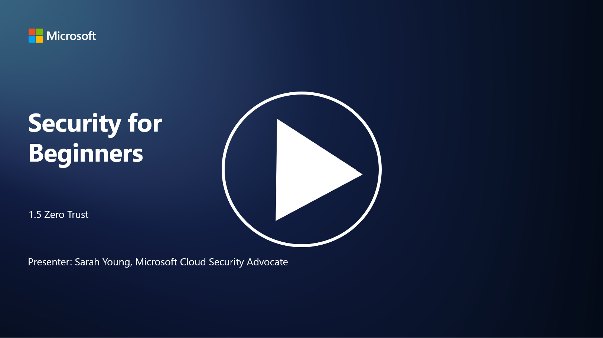

# Sıfır Güven (Zero Trust)

“Sıfır güven” (Zero Trust), günümüzde güvenlik çevrelerinde sıkça kullanılan bir terimdir. Ancak bu ne anlama gelir, sadece bir moda sözcük mü? Bu derste, sıfır güvenin tam olarak ne olduğunu inceleyeceğiz.

P.S - Video dili ingilizcedir.
## Giriş

Bu derste şunları ele alacağız:

- Sıfır güven nedir?

- Sıfır güven, geleneksel güvenlik mimarilerinden nasıl farklıdır?

- Derinlemesine savunma (defense in depth) nedir?

---

## Sıfır Güven Nedir?

Sıfır Güven, "güven ve doğrula" anlayışını sorgulayan ve bir organizasyonun ağı içinde veya dışında hiçbir varlığın doğrudan güvenilir olmaması gerektiğini varsayan bir siber güvenlik yaklaşımıdır. Bunun yerine, Sıfır Güven, kaynaklara erişmeye çalışan her kullanıcı, cihaz ve uygulamanın konumlarından bağımsız olarak doğrulanmasını savunur. Sıfır Güven’in temel ilkesi, "saldırı yüzeyini" en aza indirmek ve güvenlik ihlallerinin potansiyel etkisini azaltmaktır.

Sıfır Güven modelinde şu ilkeler vurgulanır:

1. **Kimliği Doğrula (Verify Identity)**: Tüm kullanıcılar ve cihazlar için kimlik doğrulama ve yetkilendirme, konumlarından bağımsız olarak titizlikle uygulanır. Unutmayın, bir kimlik mutlaka insan olmak zorunda değildir; bir cihaz, uygulama vb. olabilir.

2. **En Az Ayrıcalık (Least Privilege)**: Kullanıcılar ve cihazlara yalnızca görevlerini yerine getirmek için gerekli olan minimum erişim düzeyi verilir, bu da ele geçirilmeleri durumunda potansiyel zararı azaltır.

3. **Mikro Segmentasyon (Micro-Segmentation)**: Ağ kaynakları, bir ihlal durumunda ağ içinde yatay hareketi sınırlamak için daha küçük segmentlere ayrılır.

4. **Sürekli İzleme (Continuous Monitoring)**: Kullanıcı ve cihaz davranışlarının sürekli izlenmesi ve analiz edilmesi, anormalliklerin ve potansiyel tehditlerin tespit edilmesini sağlar. Modern izleme teknikleri, makine öğrenimi, yapay zeka ve tehdit istihbaratını kullanarak ek bağlam ve ayrıntı sağlar.

5. **Veri Şifreleme (Data Encryption)**: Veriler, hem aktarım sırasında hem de bekleme durumunda yetkisiz erişimi önlemek için şifrelenir.

6. **Katı Erişim Kontrolü (Strict Access Control)**: Erişim kontrolleri, kullanıcı rolleri, cihaz sağlığı ve ağ konumu gibi bağlama dayalı olarak uygulanır.

Microsoft, sıfır güveni beş temel sütuna ayırır; bunları ilerleyen derslerde ele alacağız.

---

## Geleneksel Güvenlik Mimarilerinden Farkları

Sıfır Güven, geleneksel güvenlik mimarilerinden (örneğin, çevre tabanlı modeller) birkaç şekilde farklılık gösterir:

1. **Çevreye Dayalı vs. Kimlik Merkezli (Perimeter vs. Identity-Centric)**: Geleneksel modeller, ağın çevresini güvence altına almayı ve iç kullanıcılar ile cihazların güvenilir olduğunu varsaymayı hedefler. Sıfır Güven ise tehditlerin hem ağın içinden hem de dışından gelebileceğini varsayar ve kimlik tabanlı sıkı kontroller uygular.

2. **Örtük vs. Açık Güven (Implicit vs. Explicit Trust)**: Geleneksel modeller, ağ içindeki cihazlara ve kullanıcılara aksi kanıtlanana kadar örtük olarak güvenir. Sıfır Güven, kimlikleri açıkça doğrular ve sürekli olarak anormallikleri izler.

3. **Düz vs. Segmentli Ağ (Flat vs. Segmented Network)**: Geleneksel mimariler genellikle iç kullanıcıların geniş erişime sahip olduğu düz ağlar içerir. Sıfır Güven, ağı daha küçük, izole bölgelere ayırmayı savunur.

4. **Tepkisel vs. Proaktif (Reactive vs. Proactive)**: Geleneksel güvenlik, genellikle çevre güvenlik duvarları ve saldırı tespiti gibi tepkisel önlemlere dayanır. Sıfır Güven, ihlallerin olası olduğunu varsayarak proaktif bir yaklaşım benimser ve etkilerini en aza indirir.

---

## Derinlemesine Savunma (Defense in Depth)

Derinlemesine savunma, katmanlı güvenlik olarak da bilinen, bir organizasyonun varlıklarını korumak için birden fazla güvenlik kontrolü ve önlemi uygulamayı içeren bir siber güvenlik stratejisidir. Amaç, bir katman ihlal edilirse diğerlerinin hala koruma sağlayabileceği örtüşen savunma katmanları oluşturmaktır. Her katman, güvenliğin farklı bir yönüne odaklanır ve bir organizasyonun genel güvenlik duruşunu artırır.

Derinlemesine savunma, teknik, prosedürel ve fiziksel güvenlik önlemlerinin bir kombinasyonunu içerir. Bunlar; güvenlik duvarları, saldırı tespit sistemleri, erişim kontrolleri, şifreleme, kullanıcı eğitimi, güvenlik politikaları ve daha fazlasını içerebilir. Amaç, bir organizasyonun sistemlerine ve ağlarına sızmayı zorlaştıran birden fazla bariyer oluşturmaktır. Bu strateji, diğer endüstrilerde (örneğin, ulaşım) kazaların önlenmesinde kullanılan "İsviçre peyniri" modeli olarak da bilinir.

---

## İleri Okuma

- [Sıfır Güven Nedir?](https://learn.microsoft.com/security/zero-trust/zero-trust-overview?WT.mc_id=academic-96948-sayoung)  
- [Sıfır Güvenin Evrimi – Microsoft Pozisyon Belgesi](https://query.prod.cms.rt.microsoft.com/cms/api/am/binary/RWJJdT?WT.mc_id=academic-96948-sayoung)  
- [Sıfır Güven ve BeyondCorp Google Cloud | Google Cloud Blog](https://cloud.google.com/blog/topics/developers-practitioners/zero-trust-and-beyondcorp-google-cloud)
