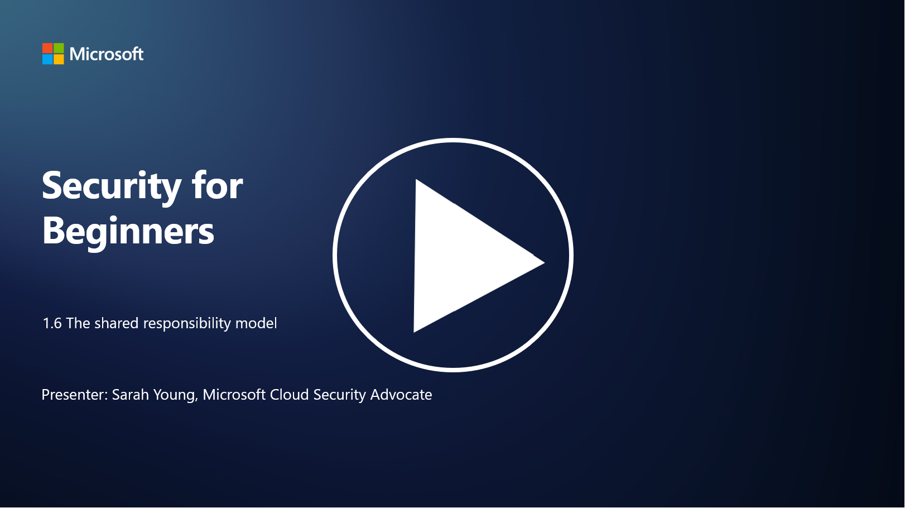

# Paylaşılan Sorumluluk Modeli

Paylaşılan sorumluluk, bulut bilişimin ortaya çıkışıyla birlikte BT'de daha yeni bir kavram olarak ortaya çıkmıştır. Siber güvenlik perspektifinden, hangi güvenlik kontrollerinin kim tarafından sağlandığını anlamak, savunmada boşlukların oluşmaması için kritik öneme sahiptir.

P.S - Video dili ingilizcedir.
## Giriş

Bu derste şunları ele alacağız:

- Siber güvenlik bağlamında paylaşılan sorumluluk nedir?

- IaaS, PaaS ve SaaS arasında güvenlik kontrolleri için paylaşılan sorumluluk farkı nedir?

- Bulut platformunuzun hangi güvenlik kontrollerini sağladığını nereden öğrenebilirsiniz?

- “Güven ama doğrula” nedir?

---

## Siber Güvenlik Bağlamında Paylaşılan Sorumluluk Nedir?

Siber güvenlikte paylaşılan sorumluluk, bir bulut hizmeti sağlayıcısı (CSP) ile müşterileri arasındaki güvenlik sorumluluklarının dağıtımını ifade eder. Altyapı Hizmeti (IaaS), Platform Hizmeti (PaaS) ve Yazılım Hizmeti (SaaS) gibi bulut bilişim ortamlarında, hem CSP hem de müşteri, verilerin, uygulamaların ve sistemlerin güvenliğini sağlamak için belirli rollere sahiptir.

---

## IaaS, PaaS ve SaaS Arasında Güvenlik Kontrolleri İçin Paylaşılan Sorumluluk Farkı Nedir?

Sorumlulukların dağılımı genellikle kullanılan bulut hizmeti türüne bağlıdır:

- **IaaS (Infrastructure as a Service)**: CSP, temel altyapıyı (sunucular, ağlar, depolama) sağlar. Müşteri ise işletim sistemlerini, uygulamaları ve bu altyapı üzerindeki güvenlik yapılandırmalarını yönetmekten sorumludur.

- **PaaS (Platform as a Service)**: CSP, müşterilerin uygulama geliştirebileceği ve dağıtabileceği bir platform sunar. CSP, altyapıyı yönetirken, müşteri uygulama geliştirme ve veri güvenliğine odaklanır.

- **SaaS (Software as a Service)**: CSP, internet üzerinden erişilebilen tam işlevsel uygulamalar sağlar. Bu durumda, CSP uygulamanın ve altyapının güvenliğinden sorumludur, müşteri ise kullanıcı erişimini ve veri kullanımını yönetir.

Paylaşılan sorumluluğu anlamak önemlidir çünkü bu, CSP'nin hangi güvenlik yönlerini kapsadığını ve müşterinin hangi güvenlik önlemlerini alması gerektiğini netleştirir. Bu, yanlış anlamaları önler ve güvenlik önlemlerinin bütünsel bir şekilde uygulanmasını sağlar.

---

## Bulut Platformunuzun Hangi Güvenlik Kontrollerini Sağladığını Nereden Öğrenebilirsiniz?

Bulut platformunuzun hangi güvenlik kontrollerini sağladığını öğrenmek için bulut hizmeti sağlayıcısının (CSP) dokümantasyonuna ve kaynaklarına başvurmanız gerekir. Bunlar şunları içerir:

- **CSP’nin Web Sitesi ve Dokümantasyonu**: CSP’nin web sitesi, sundukları hizmetlerin bir parçası olarak sağlanan güvenlik özellikleri ve kontroller hakkında bilgi içerir. CSP’ler genellikle güvenlik uygulamalarını, kontrollerini ve önerilerini açıklayan ayrıntılı dokümantasyon sunar. Bu dokümantasyon; teknik belgeler, güvenlik kılavuzları ve beyaz kitaplar içerebilir.

- **Güvenlik Değerlendirmeleri ve Denetimler**: Çoğu CSP, güvenlik kontrollerini bağımsız güvenlik uzmanları ve kuruluşlar tarafından değerlendirtir. Bu incelemeler, CSP’nin güvenlik önlemlerinin kalitesi hakkında bilgi sağlayabilir. Bazen bu değerlendirmeler, CSP’nin bir güvenlik uyumluluk sertifikası almasına yol açar (aşağıdaki maddeye bakın).

- **Güvenlik Uyumluluk Sertifikaları**: Çoğu CSP, ISO:27001, SOC 2, FedRAMP gibi sertifikalar alır. Bu sertifikalar, sağlayıcının belirli güvenlik ve uyumluluk standartlarını karşıladığını gösterir.

Unutmayın, bilgi düzeyi ve erişilebilirlik bulut sağlayıcıları arasında değişebilir. Bulut tabanlı varlıklarınızın güvenliği hakkında bilinçli kararlar almak için her zaman sağlayıcının resmi ve güncel kaynaklarını kullandığınızdan emin olun.

---

## “Güven Ama Doğrula” Nedir?

Bir CSP, üçüncü taraf yazılım veya başka bir BT güvenlik hizmeti kullanımı bağlamında, bir organizasyon başlangıçta sağlayıcının güvenlik önlemleriyle ilgili iddialarına güvenebilir. Ancak, verilerinin ve sistemlerinin güvenliğini gerçekten sağlamak için bu iddiaları güvenlik değerlendirmeleri, penetrasyon testleri ve üçüncü tarafın güvenlik kontrollerinin gözden geçirilmesi yoluyla doğrular. Tüm bireyler ve organizasyonlar, sorumlu olmadıkları güvenlik kontrollerini “güven ama doğrula” yaklaşımıyla değerlendirmelidir.

---

## Organizasyon İçinde Paylaşılan Sorumluluk

Bir organizasyon içinde farklı ekipler arasında güvenlik için paylaşılan sorumluluk da dikkate alınmalıdır. Güvenlik ekibi genellikle tüm kontrolleri kendisi uygulamaz ve organizasyonu güvende tutmak için operasyon ekipleri, geliştiriciler ve işin diğer bölümleriyle iş birliği yapması gerekir.

---

## İleri Okuma

- [Bulutta Paylaşılan Sorumluluk - Microsoft Azure | Microsoft Learn](https://learn.microsoft.com/azure/security/fundamentals/shared-responsibility?WT.mc_id=academic-96948-sayoung)  
- [Paylaşılan Sorumluluk Modeli Nedir? – TechTarget.com](https://www.techtarget.com/searchcloudcomputing/definition/shared-responsibility-model)  
- [Paylaşılan Sorumluluk Modeli Açıklaması ve Bulut Güvenliği İçin Anlamı | CSO Online](https://www.csoonline.com/article/570779/the-shared-responsibility-model-explained-and-what-it-means-for-cloud-security.html)  
- [Bulut Güvenliği İçin Paylaşılan Sorumluluk: Bilmeniz Gerekenler (cisecurity.org)](https://www.cisecurity.org/insights/blog/shared-responsibility-cloud-security-what-you-need-to-know)
