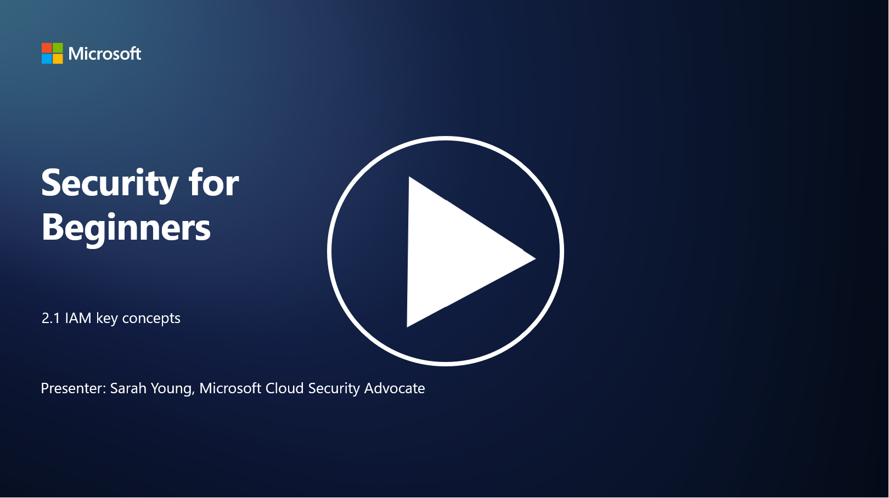

# IAM (Kimlik ve Erişim Yönetimi) Temel Kavramları

Hiç bir bilgisayara veya web sitesine giriş yaptınız mı? Tabii ki yaptınız! Bu, günlük hayatınızda kimlik kontrollerini zaten kullandığınız anlamına gelir. Kimlik ve erişim yönetimi (IAM), güvenliğin temel bir ayağıdır ve bu konuyu sonraki derslerde daha ayrıntılı olarak öğreneceğiz.

P.S - Video dili ingilizcedir.
## Giriş

Bu derste şunları ele alacağız:

- Siber güvenlik bağlamında kimlik ve erişim yönetimi (IAM) nedir?
- En az ayrıcalık ilkesi nedir?
- Görevlerin ayrılığı (segregation of duties) nedir?
- Kimlik doğrulama (authentication) ve yetkilendirme (authorization) nedir?

---

## Siber Güvenlik Bağlamında Kimlik ve Erişim Yönetimi (IAM) Nedir?

Kimlik ve Erişim Yönetimi (IAM), bir organizasyonun dijital ortamında doğru bireylerin doğru kaynaklara erişimini sağlamak için uygulanan süreçler, teknolojiler ve politikalar bütünüdür. IAM, dijital kimliklerin (kullanıcılar, çalışanlar, iş ortakları) ve bunların sistemlere, uygulamalara, verilere ve ağlara erişimlerinin yönetilmesini içerir. IAM’in temel amacı, güvenliği artırmak, kullanıcı erişimini kolaylaştırmak ve organizasyon politikaları ve düzenlemeleriyle uyumu sağlamaktır. IAM çözümleri genellikle kullanıcı kimlik doğrulama, yetkilendirme, kimlik sağlama, erişim kontrolü ve kullanıcı yaşam döngüsü yönetimini (kullanılmayan hesapların silinmesi gibi) kapsar.

---

## En Az Ayrıcalık İlkesi Nedir?

En az ayrıcalık ilkesi, kullanıcılar ve sistemlere yalnızca görevlerini veya rollerini yerine getirmek için gerekli olan minimum ayrıcalıkların verilmesini savunan temel bir kavramdır. Bu ilke, bir güvenlik ihlali veya içeriden gelen tehdit durumunda oluşabilecek potansiyel zararı sınırlamaya yardımcı olur. En az ayrıcalık ilkesine uyarak, organizasyonlar saldırı yüzeyini azaltır ve yetkisiz erişim, veri ihlalleri ve ayrıcalıkların yanlış kullanım riskini en aza indirir. Pratikte bu, kullanıcılara yalnızca iş rolleri için gerekli olan belirli kaynaklara ve işlevlere erişim verilmesi anlamına gelir. Örneğin, bir belgeyi yalnızca okumanız gerekiyorsa, o belgeye tam yönetici ayrıcalıkları verilmesi gereksiz olur.

---

## Görevlerin Ayrılığı (Segregation of Duties) Nedir?

Görevlerin ayrılığı, çıkar çatışmalarını önlemeyi ve dolandırıcılık ile hataların riskini azaltmayı amaçlayan bir ilkedir. Bu ilke, kritik görevlerin ve sorumlulukların bir organizasyon içinde farklı bireyler arasında dağıtılmasını gerektirir. Siber güvenlik bağlamında, görevlerin ayrılığı, hiçbir bireyin bir sürecin veya sistemin tüm yönleri üzerinde kontrol sahibi olmamasını sağlamayı içerir. Amaç, bir sürecin kurulum ve onay aşamalarını aynı kişinin gerçekleştirememesini sağlayarak bir denetim ve denge sistemi oluşturmaktır. Örneğin, finansal sistemlerde, sisteme işlemleri giren kişinin bu işlemleri onaylayan kişi olmaması gerekir. Bu, yetkisiz veya sahte işlemlerin fark edilmeden gerçekleşme riskini azaltır.

---

## Kimlik Doğrulama (Authentication) ve Yetkilendirme (Authorization) Nedir?

Kimlik doğrulama ve yetkilendirme, bilgisayar sistemlerinin ve verilerin güvenliğini ve bütünlüğünü sağlamada kritik rol oynayan iki temel kavramdır. Bu kavramlar, kaynaklara erişimi kontrol etmek ve hassas bilgileri korumak için genellikle birlikte kullanılır.

### 1. Kimlik Doğrulama (Authentication)

Kimlik doğrulama, bir kullanıcı, sistem veya varlığın belirli bir bilgisayar sistemi veya kaynağa erişim talebinde bulunurken kimliğini doğrulama sürecidir. Bu süreç, talep edilen kimliğin gerçek ve doğru olduğunu garanti eder. Kimlik doğrulama yöntemleri genellikle şu faktörlerden bir veya daha fazlasını içerir:

- **Bildiğiniz bir şey**: Şifreler, PIN’ler veya yalnızca yetkili kullanıcının bildiği diğer gizli bilgiler.
- **Sahip olduğunuz bir şey**: Akıllı kartlar, güvenlik belirteçleri veya kimliği doğrulamak için kullanılan mobil cihazlar gibi fiziksel araçlar.
- **Olduğunuz bir şey**: Parmak izi, yüz tanıma veya retina taramaları gibi bireye özgü biyometrik faktörler.

Kimlik doğrulama mekanizmaları, bir kullanıcının iddia ettiği kişi olduğunu doğrulamak için kullanılır ve yetkisiz erişimi önler.

### 2. Yetkilendirme (Authorization)

Yetkilendirme, kimliği doğrulanmış kullanıcıların veya varlıkların belirli izin ve ayrıcalıklarının verilmesi veya reddedilmesi sürecidir. Bu süreç, bir kullanıcının sistem içinde hangi işlemleri gerçekleştirebileceğini veya hangi kaynaklara erişebileceğini belirler. Yetkilendirme genellikle önceden tanımlanmış politikalar, erişim kontrol kuralları ve kullanıcılara atanan roller temelinde gerçekleştirilir.

Yetkilendirme, "Kimliği doğrulanmış bir kullanıcı ne yapabilir?" sorusuna yanıt verir. Hassas verileri ve kaynakları yetkisiz erişim veya değişikliklerden korumak için erişim kontrol politikalarının tanımlanmasını ve uygulanmasını içerir.

### Özet:

- **Kimlik Doğrulama**: Kullanıcıların veya varlıkların kimliğini doğrular.
- **Yetkilendirme**: Kimliği doğrulanmış kullanıcıların hangi işlemleri yapabileceğini belirler.

---

## İleri Okuma

- [Kimlik Kavramlarını Açıklayın - Microsoft Learn](https://learn.microsoft.com/training/modules/describe-identity-principles-concepts/?WT.mc_id=academic-96948-sayoung)  
- [Kimliğe Giriş - Microsoft Entra | Microsoft Learn](https://learn.microsoft.com/azure/active-directory/fundamentals/identity-fundamental-concepts?WT.mc_id=academic-96948-sayoung)  
- [Kimlik ve Erişim Yönetimi (IAM) Nedir? | Microsoft Security](https://www.microsoft.com/security/business/security-101/what-is-identity-access-management-iam?WT.mc_id=academic-96948-sayoung)  
- [IAM Nedir? Kimlik ve Erişim Yönetimi Açıklaması | CSO Online](https://www.csoonline.com/article/518296/what-is-iam-identity-and-access-management-explained.html)  
- [IAM Nedir? (auth0.com)](https://auth0.com/blog/what-is-iam/)  
- [Security+: Kimlik ve Erişim Yönetimi (IAM) Kontrollerini Uygulama | Infosec](https://resources.infosecinstitute.com/certifications/securityplus/security-implementing-identity-and-access-management-iam-controls/)  
- [En Az Ayrıcalık - Terimler Sözlüğü | CSRC (nist.gov)](https://csrc.nist.gov/glossary/term/least_privilege)  
- [Güvenlik: En Az Ayrıcalık İlkesi (POLP) - Microsoft Community Hub](https://techcommunity.microsoft.com/t5/azure-sql-blog/security-the-principle-of-least-privilege-polp/ba-p/2067390?WT.mc_id=academic-96948-sayoung)  
- [En Az Ayrıcalık İlkesi | CERT NZ](https://www.cert.govt.nz/it-specialists/critical-controls/principle-of-least-privilege/)  
- [Neden Görevlerin Ayrılığı NIST 800-171 ve CMMC Tarafından Gereklidir? - (totem.tech)](https://www.totem.tech/cmmc-separation-of-duties/)
