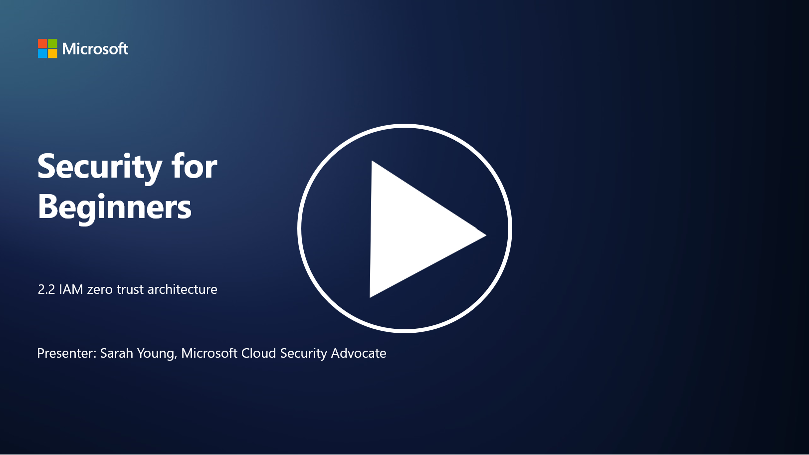

# IAM ve Sıfır Güven Mimarisi

Kimlik, sıfır güven mimarisini uygulamanın ve herhangi bir BT ortamı için bir çevre oluşturmanın önemli bir parçasıdır. Bu bölümde, sıfır güveni uygulamak için kimlik kontrollerini kullanmanın neden önemli olduğunu inceleyeceğiz.

P.S - Video dili ingilizcedir.
## Giriş

Bu derste şunları ele alacağız:

- Modern BT ortamlarında neden kimliği çevremiz olarak kullanmamız gerekiyor?
- Bu, geleneksel BT mimarilerinden nasıl farklıdır?
- Kimlik, sıfır güven mimarisini uygulamak için nasıl kullanılır?

---

## Modern BT Ortamlarında Neden Kimliği Çevremiz Olarak Kullanmalıyız?

Modern BT ortamlarında, fiziksel bir çevre (güvenlik duvarları ve ağ sınırları gibi araçlar kullanılarak) siber tehditlere karşı birincil savunma hattı olarak kullanılan geleneksel kavram, teknolojinin artan karmaşıklığı, uzaktan çalışma ve bulut hizmetlerinin benimsenmesi nedeniyle giderek daha az etkili hale geliyor. Bunun yerine, organizasyonlar kimliği yeni çevre olarak kullanmaya yöneliyor. Bu, güvenliğin, kullanıcıların, cihazların ve uygulamaların fiziksel konumlarından bağımsız olarak kaynaklara erişimlerini doğrulama ve yönetme etrafında döndüğü anlamına gelir.

Kimliği çevre olarak kullanmanın modern BT ortamlarında neden önemli olduğuna dair bazı nedenler:

- **Uzaktan Çalışma**: Uzaktan çalışma ve mobil cihazların norm haline gelmesiyle, kullanıcılar çeşitli konum ve cihazlardan kaynaklara erişebiliyor. Geleneksel çevre yaklaşımı, kullanıcılar fiziksel bir ofisle sınırlı olmadığında işe yaramaz.
- **Bulut ve Hibrit Ortamlar**: Organizasyonlar giderek daha fazla bulut hizmetlerini ve hibrit ortamları benimsiyor. Veriler ve uygulamalar artık yalnızca organizasyonun tesislerinde bulunmadığından, geleneksel çevre savunmaları daha az geçerli hale geliyor.
- **Sıfır Güven Güvenliği**: Sıfır güven güvenliği konsepti, ağın içinde veya dışında hiçbir varlığın otomatik olarak güvenilir olmaması gerektiğini varsayar. Kimlik, erişim taleplerini doğrulamanın temeli haline gelir.
- **Tehdit Ortamı**: Siber tehditler evrim geçiriyor ve saldırganlar geleneksel çevre savunmalarını aşmanın yollarını buluyor. Kimlik avı, sosyal mühendislik ve içeriden gelen tehditler genellikle ağ çevrelerini ihlal etmeye çalışmak yerine insan zafiyetlerini istismar eder.
- **Veri Merkezli Yaklaşım**: Hassas verilerin korunması çok önemlidir. Kimliğe odaklanarak, organizasyonlar kimin hangi verilere eriştiğini kontrol edebilir ve veri ihlali riskini azaltabilir.

---

## Bu, Geleneksel BT Mimarilerinden Nasıl Farklıdır?

Geleneksel BT mimarileri, tehditleri dışarıda tutmada güvenlik duvarları ve ağ sınırlarının önemli bir rol oynadığı çevre tabanlı güvenlik modellerine dayanıyordu. Geleneksel ve kimlik merkezli yaklaşımlar arasındaki temel farklar şunlardır:

| **Konu**               | **Geleneksel BT Mimarileri**                                                                 | **Kimlik Merkezli Yaklaşım**                                                                 |
|-------------------------|---------------------------------------------------------------------------------------------|---------------------------------------------------------------------------------------------|
| **Odak**               | Çevre Odaklı: Güvenlik duvarları ve erişim kontrolü gibi çevre savunmalarına dayanır.         | Kimlik Doğrulama Odaklı: Ağ sınırlarından kimlik doğrulamaya geçiş.                         |
| **Konum**              | Konuma Bağımlılık: Güvenlik, fiziksel ofis konumlarına ve ağ sınırlarına bağlıdır.            | Konumdan Bağımsızlık: Güvenlik, belirli konumlara bağlı değildir; her yerden erişim sağlanır.|
| **Güven Varsayımı**    | Varsayılan Güven: Ağ çevresi içindeki kullanıcılar/cihazlar güvenilir kabul edilir.            | Sıfır Güven Yaklaşımı: Güven asla varsayılmaz; erişim kimlik ve bağlama göre doğrulanır.     |
| **Cihaz Dikkate Alımı**| Cihaz Çeşitliliği: Ağ çevresi içindeki cihazların güvenli olduğu varsayılır.                   | Cihaz Farkındalığı: Konumdan bağımsız olarak cihaz sağlığı ve güvenlik durumu dikkate alınır.|
| **Veri Koruma**        | Veri Koruma: Veri koruması için ağ çevrelerini güvence altına almaya odaklanır.               | Veri Merkezli Koruma: Kimlik ve veri hassasiyetine dayalı veri erişim kontrolüne odaklanır.  |

---

## Identity, Sıfır Güven Mimarisi Uygulamak İçin Nasıl Kullanılır?

Sıfır güven mimarisinde temel ilke, ağ çevresi içinde veya dışında olmasına bakılmaksızın hiçbir varlığa otomatik olarak güvenilmemesidir. Identity, kaynaklara erişmeye çalışan varlıkların sürekli doğrulanmasını sağlayarak sıfır güven yaklaşımını uygulamada merkezi bir rol oynar. Modern kimlik güvenlik kontrolleri, her kullanıcı, cihaz, uygulama ve hizmetin kaynaklara erişim talep etmeden önce kimliğinin doğrulanmasını sağlar. Bu, kullanıcı adı/şifre kombinasyonları, çok faktörlü kimlik doğrulama (MFA), biyometrik doğrulama ve diğer güçlü kimlik doğrulama mekanizmaları gibi yöntemlerle dijital kimliklerinin doğrulanmasını içerir.

---

## İleri Okuma

- [Identity ile Sıfır Güven Güvenliği Sağlama | Microsoft Learn](https://learn.microsoft.com/security/zero-trust/deploy/identity?WT.mc_id=academic-96948-sayoung)  
- [Sıfır Güven İlkeleri ve Identity ve Erişim için Rehberlik | CSA](https://cloudsecurityalliance.org/artifacts/zero-trust-principles-and-guidance-for-iam/)  
- [Sıfır Güven Kimlik Kontrolleri - Essentials Serisi - Bölüm 2 - YouTube](https://www.youtube.com/watch?v=fQZQznIKcGM&list=PLXtHYVsvn_b_gtX1-NB62wNervQx1Fhp4&index=13)
