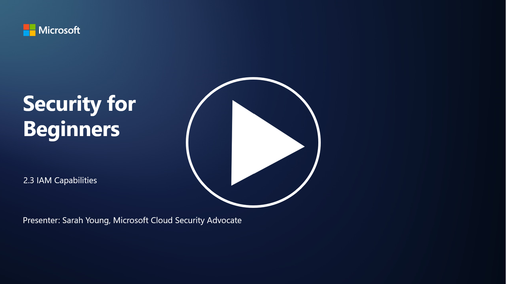

# IAM Yetenekleri

Bu bölümde, kimlik güvenliğinde kullanılan temel araçlar ve yetenekler hakkında daha fazla ayrıntıya değineceğiz.

P.S - Video dili ingilizcedir.
## Giriş

Bu derste şunları ele alacağız:

- Dizin hizmeti (directory service) nedir?
- Kimlikleri güvence altına almak için hangi yetenekler kullanılabilir?

> **Kimlik Güvenliği Yetenekleri:**
> 
> - Çok Faktörlü Kimlik Doğrulama (MFA)
> - Tek Oturum Açma (SSO)
> - Rol Tabanlı Erişim Kontrolü (RBAC)
> - Uyarlanabilir Kimlik Doğrulama
> - Biyometrik Kimlik Doğrulama
> - Ayrıcalıklı Erişim Yönetimi (PAM)
> - Kimlik Yönetimi ve Yönetişimi (IGA)
> - Davranış Analitiği

---

## Dizin Hizmeti (Directory Service) Nedir?

Dizin hizmeti, kullanıcılar, gruplar, cihazlar, uygulamalar ve diğer nesneler dahil olmak üzere ağ kaynakları hakkında bilgi depolayan ve yöneten özel bir veritabanıdır. Kimlik ve erişimle ilgili verilerin merkezi bir deposu olarak hizmet eder ve organizasyonların kullanıcı kimlik doğrulama, yetkilendirme ve diğer güvenlikle ilgili görevleri verimli bir şekilde yönetmesini sağlar.

Dizin hizmetleri, modern BT ortamlarında kimlik ve erişim yönetimi (IAM) çözümleri için bir temel sağlar. Kaynaklara güvenli erişim sağlar, erişim politikalarını uygular ve yönetim görevlerini basitleştirir. En bilinen dizin hizmetlerinden biri Microsoft Active Directory'dir, ancak LDAP (Lightweight Directory Access Protocol) gibi diğer çözümler de benzer amaçlara hizmet eder.

Siber güvenlik bağlamında bir dizin hizmetinin temel işlevleri ve özellikleri şunlardır:

- **Kullanıcı Kimlik Doğrulama**: Dizin hizmetleri, yalnızca yetkili kullanıcıların ağa ve kaynaklara erişmesini sağlamak için kullanıcı kimlik bilgilerini (örneğin, kullanıcı adı ve şifre) doğrular.
- **Kullanıcı Yetkilendirme**: Kullanıcıların rollerine, grup üyeliklerine ve diğer niteliklerine göre erişim düzeylerini belirler. Bu, kullanıcıların yalnızca yetkili oldukları kaynaklara erişmesini sağlar.
- **Grup Yönetimi**: Dizin hizmetleri, yöneticilerin kullanıcıları mantıksal gruplar halinde organize etmesine olanak tanır ve erişim kontrol yönetimini basitleştirir. İzinler bireysel kullanıcılara değil, gruplara atanabilir.
- **Şifre Politikaları**: Şifre karmaşıklığı ve süresi gibi kuralları uygular, kullanıcı hesaplarının güvenliğini artırır.
- **Tek Oturum Açma (SSO)**: Bazı dizin hizmetleri, kullanıcıların tek bir kimlik bilgisi setiyle birden fazla uygulama ve hizmete erişmesini sağlayan SSO'yu destekler.
- **Merkezi Kullanıcı Yönetimi**: Dizin hizmetleri, kullanıcı bilgilerini merkezi bir yerde toplar ve kullanıcı hesaplarını, profillerini ve niteliklerini yönetmeyi kolaylaştırır.
- **Denetim ve Kayıt Tutma**: Kullanıcı kimlik doğrulama ve erişim etkinliklerini kaydedebilir, bu da güvenlik denetimleri ve uyumluluk çabalarına yardımcı olur.

---

## Kimlikleri Güvence Altına Almak İçin Hangi Yetenekler Kullanılabilir?

### **Çok Faktörlü Kimlik Doğrulama (MFA)**

MFA, erişim izni vermeden önce kullanıcıların birden fazla doğrulama yöntemi sağlamasını gerektirir. Genellikle şunları içerir:
- **Bildiğiniz bir şey**: Şifre veya PIN.
- **Sahip olduğunuz bir şey**: Akıllı telefon veya güvenlik belirteci.
- **Olduğunuz bir şey**: Parmak izi veya yüz tanıma gibi biyometrik veriler.

### **Tek Oturum Açma (SSO)**

SSO, kullanıcıların tek bir kimlik bilgisi setiyle birden fazla uygulama ve sisteme erişmesini sağlar. Bu, kullanıcı deneyimini iyileştirir ve birden fazla şifre yönetimiyle ilişkili riskleri azaltır.

### **Rol Tabanlı Erişim Kontrolü (RBAC)**

RBAC, izinleri önceden tanımlanmış rollere göre atar. Kullanıcılara, organizasyondaki rollerine dayalı olarak erişim verilir.

### **Uyarlanabilir Kimlik Doğrulama**

Uyarlanabilir kimlik doğrulama, konum, cihaz, erişim zamanı ve kullanıcı davranışı gibi risk faktörlerini değerlendirerek gerekli kimlik doğrulama düzeyini dinamik olarak ayarlar. Şüpheli bir istek algılanırsa, ek kimlik doğrulama adımları tetiklenebilir.

### **Biyometrik Kimlik Doğrulama**

Biyometrik kimlik doğrulama, parmak izi, yüz özellikleri, ses desenleri ve hatta yazma hızı gibi benzersiz biyolojik özellikleri kimlik doğrulama için kullanır.

### **Ayrıcalıklı Erişim Yönetimi (PAM)**

PAM, kritik sistemlere ve verilere erişimi güvence altına almayı hedefler. Ayrıcalıklı hesaplar üzerinde sıkı kontroller uygular ve "tam zamanında erişim" ve oturum izleme gibi özellikler içerir.

### **Kimlik Yönetimi ve Yönetişimi (IGA)**

IGA çözümleri, kullanıcı kimliklerini ve bunların yaşam döngüsü boyunca kaynaklara erişimlerini yönetir. Bu, işe alım, yetkilendirme, rol tabanlı erişim kontrolü ve erişim iptali gibi süreçleri içerir.

### **Davranış Analitiği**

Davranış analitiği, kullanıcı davranışlarını izler ve temel kalıplar oluşturur. Normdan sapmalar, daha fazla araştırma için uyarılar tetikleyebilir.

---

## İleri Okuma

- [Azure Active Directory Temelleri Belgeleri - Microsoft Entra | Microsoft Learn](https://learn.microsoft.com/azure/active-directory/fundamentals/?WT.mc_id=academic-96948-sayoung)  
- [Azure Active Directory Nedir? - Microsoft Entra | Microsoft Learn](https://learn.microsoft.com/azure/active-directory/fundamentals/whatis?WT.mc_id=academic-96948-sayoung)  
- [Çoklu Bulut Kimlik Altyapınızı Microsoft Entra ile Yönetin - YouTube](https://www.youtube.com/watch?v=9qQiq3wTS2Y&list=PLXtHYVsvn_b_gtX1-NB62wNervQx1Fhp4&index=18)
