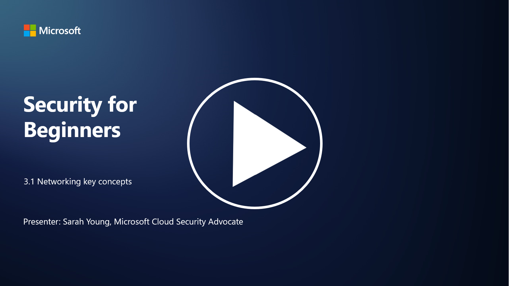

# Ağ (Network) Temel Kavramları

P.S - Video dili ingilizcedir.

BT alanında çalıştıysanız, muhtemelen ağ kavramlarına aşinasınızdır. Modern ortamlarda kimliği birincil çevre kontrolü olarak kullansak da, bu ağ kontrollerinin gereksiz olduğu anlamına gelmez. Bu derste, ağlarla ilgili bazı temel kavramları ele alacağız.

## Giriş

Bu derste şunları ele alacağız:

- IP adresleme nedir?
- OSI modeli nedir?
- TCP/UDP nedir?
- Port numaraları nedir?
- Bekleyen ve iletim halindeki verilerin şifrelenmesi nedir?

---

## IP Adresleme Nedir?

IP adresleme (Internet Protocol adresleme), internet protokolünü kullanarak bir bilgisayar ağına bağlı her cihaza atanan sayısal bir etikettir. Bu, cihazların internet veya diğer bağlı ağlar üzerinden veri göndermesine ve almasına olanak tanıyan benzersiz bir tanımlayıcı görevi görür. IP adreslemenin iki ana sürümü vardır: IPv4 (Internet Protocol version 4) ve IPv6 (Internet Protocol version 6). Bir IP adresi genellikle şu formatlarda temsil edilir:

- **IPv4**: Örneğin, `192.168.1.1`
- **IPv6**: Örneğin, `2001:0db8:85a3:0000:0000:8a2e:0370:7334`

---

## OSI Modeli Nedir?

OSI (Open Systems Interconnection) modeli, bir iletişim sisteminin işlevlerini yedi farklı katmana ayıran kavramsal bir çerçevedir. Her katman belirli görevleri yerine getirir ve cihazlar arasında verimli ve güvenilir veri iletişimini sağlamak için bitişik katmanlarla iletişim kurar. Katmanlar aşağıdaki gibidir (alttan üste doğru):

1. **Fiziksel Katman (Physical Layer)**
2. **Veri Bağlantı Katmanı (Data Link Layer)**
3. **Ağ Katmanı (Network Layer)**
4. **Taşıma Katmanı (Transport Layer)**
5. **Oturum Katmanı (Session Layer)**
6. **Sunum Katmanı (Presentation Layer)**
7. **Uygulama Katmanı (Application Layer)**

OSI modeli, donanım veya yazılım uygulamalarından bağımsız olarak ağ protokollerinin ve teknolojilerinin nasıl etkileşimde bulunduğunu anlamak için ortak bir referans sağlar.

  
_Referans: [OSI Modeli - Wikipedia](https://tr.wikipedia.org/wiki/OSI_modeli)_

---

## TCP/UDP Nedir?

**TCP (Transmission Control Protocol)** ve **UDP (User Datagram Protocol)**, cihazlar arasında internet veya yerel ağ üzerinden iletişimi kolaylaştırmak için kullanılan iki temel taşıma katmanı protokolüdür. Verileri paketlere ayırmaktan ve bu paketleri alıcı tarafta yeniden birleştirmekten sorumludurlar. Ancak, özellikleri ve kullanım durumları farklıdır.

### **TCP (Transmission Control Protocol)**

- **Bağlantı Odaklı**: TCP, veri alışverişi başlamadan önce gönderici ve alıcı arasında bir bağlantı kurar.
- **Güvenilirlik**: TCP, veri paketlerinin doğru sırada ulaşmasını sağlar ve kaybolan paketlerin yeniden iletilmesini sağlar.
- **Kullanım Alanları**: Web tarama, e-posta, dosya transferi (FTP) ve veritabanı iletişimi gibi güvenilir veri iletimi gerektiren uygulamalar.

### **UDP (User Datagram Protocol)**

- **Bağlantısız**: UDP, veri göndermeden önce bir bağlantı kurmaz.
- **Hız ve Verimlilik**: Daha hızlı veri iletimi sağlar ancak TCP kadar güvenilir değildir. Paket kaybı veya sıralama hatalarını düzeltmez.
- **Kullanım Alanları**: Gerçek zamanlı iletişim, medya akışı, çevrimiçi oyunlar ve DNS sorguları gibi hızın önemli olduğu uygulamalar.

**Özet:**  
- TCP, güvenilirlik ve sıralı teslimatı önceliklendirir.  
- UDP, hız ve düşük gecikmeyi önceliklendirir.  

---

## Port Numaraları Nedir?

Ağlarda, port numarası, bir cihazdaki farklı hizmetleri veya uygulamaları ayırt etmek için kullanılan sayısal bir tanımlayıcıdır. Portlar, gelen verilerin doğru uygulamaya yönlendirilmesine yardımcı olur. Port numaraları 16 bitlik tamsayılar olarak tanımlanır ve 0 ile 65535 arasında değişir. Üç ana aralığa ayrılır:

- **Well-Known Ports (0-1023)**: HTTP (port 80) ve FTP (port 21) gibi standart hizmetler için ayrılmıştır.
- **Registered Ports (1024-49151)**: Standart olmayan ancak resmi olarak kayıtlı uygulamalar ve hizmetler için kullanılır.
- **Dynamic/Private Ports (49152-65535)**: Geçici veya özel kullanım için uygulamalar tarafından kullanılabilir.

---

## Bekleyen ve İletim Halindeki Verilerin Şifrelenmesi Nedir?

Şifreleme, verileri yetkisiz erişim veya müdahaleden korumak için güvenli bir formata dönüştürme işlemidir. Şifreleme, hem "bekleyen" (cihazda veya sunucuda depolanan) hem de "iletişim halindeki" (cihazlar arasında veya ağlar üzerinden iletilen) verilere uygulanabilir.

### **Bekleyen Verilerin Şifrelenmesi**

- Depolama cihazlarında, sunucularda veya diğer depolama sistemlerinde saklanan verilerin şifrelenmesini içerir.
- Bir saldırgan fiziksel depolama ortamına erişim sağlasa bile, şifreleme anahtarları olmadan verilere erişemez.
- Cihaz hırsızlığı, veri ihlalleri veya yetkisiz erişim durumlarında hassas verileri korumak için önemlidir.

### **İletim Halindeki Verilerin Şifrelenmesi**

- Verilerin cihazlar arasında veya ağlar üzerinden iletilirken şifrelenmesini içerir.
- Veri aktarımı sırasında dinleme ve yetkisiz müdahaleyi önler.
- Yaygın protokoller: HTTPS (web iletişimi için) ve TLS/SSL (çeşitli ağ trafiğini güvence altına almak için).

---

## İleri Okuma

- [IP Adresleri Nasıl Çalışır? (howtogeek.com)](https://www.howtogeek.com/341307/how-do-ip-addresses-work/)  
- [IP Adreslerini Anlamak: Giriş Rehberi (geekflare.com)](https://geekflare.com/understanding-ip-address/)  
- [OSI Modeli Nedir? 7 Katmanlı OSI Açıklaması (techtarget.com)](https://www.techtarget.com/searchnetworking/definition/OSI)  
- [OSI Modeli – Ağ Katmanları Basitçe Açıklandı (freecodecamp.org)](https://www.freecodecamp.org/news/osi-model-networking-layers-explained-in-plain-english/)  
- [TCP/IP Protokolleri - IBM Belgeleri](https://www.ibm.com/docs/en/aix/7.3?topic=protocol-tcpip-protocols)  
- [Ortak Portlar Cheat Sheet: Nihai Portlar ve Protokoller Listesi (stationx.net)](https://www.stationx.net/common-ports-cheat-sheet/)  
- [Azure'da Bekleyen Verilerin Şifrelenmesi - Azure Güvenliği | Microsoft Learn](https://learn.microsoft.com/azure/security/fundamentals/encryption-atrest?WT.mc_id=academic-96948-sayoung)
