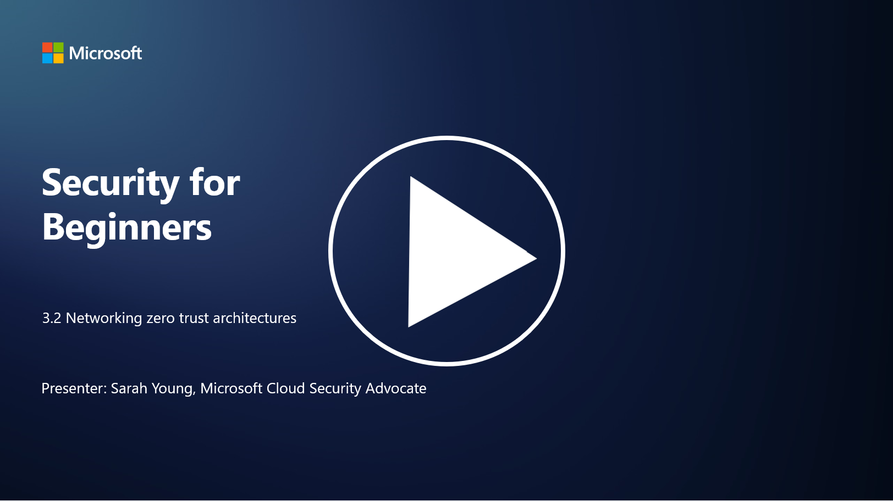

# Ağ ve Sıfır Güven Mimarileri

P.S - Video dili ingilizcedir.

Ağ, sıfır güven kontrollerinde kritik bir katman sağlar. Bu derste aşağıdaki konuları öğreneceğiz:

- Ağ segmentasyonu nedir?  
- Ağ segmentasyonu sıfır güveni nasıl uygular?  
- Uçtan uca şifreleme nedir?  

---

## Ağ Segmentasyonu Nedir?

Ağ segmentasyonu, bir ağı daha küçük, izole edilmiş segmentlere veya alt ağlara bölme uygulamasıdır. Her segment diğerlerinden izole edilir ve segmentler arası erişim, belirli güvenlik politikalarına dayalı olarak kontrol edilir ve kısıtlanır. Ağ segmentasyonu, potansiyel ihlallerin etkisini sınırlayarak ve saldırganların ağ içinde yatay hareketini engelleyerek güvenliği artırmak için kullanılır.

Ağ segmentasyonu uygulayarak, bir organizasyon farklı kullanıcı türlerini, uygulamaları ve verileri ayıran "bölgeler" oluşturabilir. Bu, saldırı yüzeyini azaltır ve bir güvenlik olayının neden olabileceği potansiyel hasarı en aza indirir. Ağ segmentasyonu, sanal LAN'lar (VLAN'lar), güvenlik duvarları ve erişim kontrolleri gibi teknolojilerle gerçekleştirilebilir.

---

## Ağ Segmentasyonu Sıfır Güveni Nasıl Uygular?

Ağ segmentasyonu, Sıfır Güven modelinin ilkeleriyle yakından uyumludur. Sıfır Güven mimarisinde, ağ segmentasyonu "en az ayrıcalık" ilkesini uygulamaya yardımcı olur. Bu, kullanıcıların ve cihazların yalnızca görevlerini yerine getirmek için ihtiyaç duydukları belirli kaynaklara ve hizmetlere erişim sağlamasını garanti eder. Ağı daha küçük bölgelere ayırarak, organizasyonlar sıkı erişim kontrolleri uygulayabilir, kritik varlıkları izole edebilir ve saldırganların yatay hareketini önleyebilir.

Ağ segmentasyonu ayrıca kimlik tabanlı erişim kontrollerini uygulamaya yardımcı olur. Bu, kullanıcıların ve cihazların belirli segmentlere erişmeden önce kimlik doğrulama ve yetkilendirme süreçlerinden geçmesini sağlar. Bu, yetkisiz erişimi engeller ve ele geçirilmiş kimlik bilgileri durumunda potansiyel etkileri azaltır.

---

## Uçtan Uca Şifreleme (E2E) Nedir?

Uçtan uca (E2E) şifreleme, verilerin göndericiden alıcıya kadar olan yolculuğu boyunca şifreli kalmasını sağlayan bir güvenlik önlemidir. Bu süreçte, veriler göndericinin tarafında şifrelenir ve yalnızca alıcı, verileri çözmek ve okumak için gerekli şifre çözme anahtarına sahiptir. Şifreleme ve şifre çözme işlemleri uç noktalarda gerçekleşir, bu da hizmet sağlayıcılar ve aracı sistemler dahil olmak üzere yetkisiz tarafların düz metin verilere erişmesini son derece zorlaştırır.

E2E şifreleme, verilerin çeşitli aracı sistemler veya ağlar üzerinden geçse bile yüksek düzeyde gizlilik ve güvenlik sağlar. Bu yöntem, güvenli mesajlaşma uygulamaları, e-posta hizmetleri ve diğer iletişim platformlarında hassas bilgileri korumak için yaygın olarak kullanılır.

Bu şifreleme yöntemi, saldırganlar verileri iletim sırasında ele geçirse bile yalnızca anlamsız şifreli içerik görecekleri anlamına gelir. Şifre çözme anahtarı olmadan bu veriler kullanılamaz. Uçtan uca şifreleme, kullanıcı gizliliğini korumada ve hassas bilgilerin yetkisiz taraflara maruz kalmasını önlemede önemli bir rol oynar.

---

## SASE Nedir?

SASE (Secure Access Service Edge), ağ güvenliği ve geniş alan ağı (WAN) yeteneklerini tek bir bulut tabanlı hizmette birleştiren bir siber güvenlik çerçevesi ve mimarisidir. SASE, uzaktan ve mobil kullanıcılar için ağ kaynaklarına, uygulamalara ve verilere güvenli ve ölçeklenebilir erişim sağlarken, ağ yönetimini basitleştirir ve geleneksel ağ ve güvenlik mimarilerinin karmaşıklığını azaltır.

### SASE'nin Temel Özellikleri ve Bileşenleri:

1. **Bulut Tabanlı:** SASE, bir bulut hizmeti olarak sunulur. Güvenlik ve ağ işlevleri, geleneksel yerinde donanım ve cihazlara dayanmadan buluttan sağlanır.
   
2. **Güvenlik ve Ağın Entegrasyonu:** SASE, güvenli web ağ geçitleri (SWG), hizmet olarak güvenlik duvarı (FWaaS), veri kaybı önleme (DLP), sıfır güven ağ erişimi (ZTNA) ve WAN optimizasyonu gibi çeşitli güvenlik hizmetlerini geniş alan ağı yetenekleriyle entegre eder. Bu entegrasyon, güvenlik ve ağ operasyonlarını kolaylaştırır.
   
3. **Sıfır Güven:** SASE, sıfır güven ilkesine dayanır. Bu, sıkı erişim kontrolleri ve en az ayrıcalık erişim politikalarını uygular. Kullanıcılar ve cihazlar varsayılan olarak güvenilmez ve kaynaklara erişmeden önce kimlik doğrulama ve yetkilendirme süreçlerinden geçmelidir.
   
4. **Kimlik Merkezli:** SASE, erişim kontrolünün temeli olarak kullanıcı ve cihaz kimliklerine odaklanır. Kimlik ve bağlama dayalı politikalar, erişim izinlerini belirlemek için kullanılır ve bu politikalar kullanıcı davranışına ve bağlama göre dinamik olarak uyarlanır.
   
5. **Ölçeklenebilirlik ve Esneklik:** SASE, çok sayıda kullanıcı ve cihazı destekleyecek şekilde kolayca ölçeklenebilir. Bu, çeşitli ve değişen ağ ve güvenlik ihtiyaçlarına sahip organizasyonlar için uygundur.

SASE, uzaktan çalışma ve bulut benimseme çağında özellikle önemlidir. Kullanıcı merkezli ve sıfır güven güvenlik modellerine güçlü bir şekilde odaklanarak, ağ erişimini güvence altına almak ve yönetmek için kapsamlı ve esnek bir yaklaşım sunar.

---

## İleri Okuma

- [Ağ Segmentasyonu Nedir? - Cisco](https://www.cisco.com/c/en/us/products/security/what-is-network-segmentation.html#~benefits)  
- [Mikro-Segmentasyon Nedir? - Cisco](https://www.cisco.com/c/en/us/products/security/what-is-microsegmentation.html)  
- [Ağ Segmentasyonu ve Ayrıştırma Uygulama | Cyber.gov.au](https://www.cyber.gov.au/resources-business-and-government/maintaining-devices-and-systems/system-hardening-and-administration/network-hardening/implementing-network-segmentation-and-segregation)  
- [Ağ Segmentasyonu Nedir ve Neden Önemlidir? | CompTIA](https://www.comptia.org/blog/security-awareness-training-network-segmentation)  
- [Ağ Segmentasyonu: Kavramlar ve Uygulamalar (cmu.edu)](https://insights.sei.cmu.edu/blog/network-segmentation-concepts-and-practices/)  
- [Sıfır Güven ile Güvenli Ağlar | Microsoft Learn](https://learn.microsoft.com/security/zero-trust/deploy/networks?WT.mc_id=academic-96948-sayoung)  
- [Uçtan Uca Şifreleme Nedir? | IBM](https://www.ibm.com/topics/end-to-end-encryption)  
- [Uçtan Uca Şifreleme Nedir ve Neden Önemlidir? (howtogeek.com)](https://www.howtogeek.com/711656/what-is-end-to-end-encryption-and-why-does-it-matter/)  
- [Secure Access Service Edge (SASE) Tanımı - Gartner](https://www.gartner.com/en/information-technology/glossary/secure-access-service-edge-sase)  
- [Secure Access Service Edge (SASE) Nedir? | Microsoft Security](https://www.microsoft.com/security/business/security-101/what-is-sase?WT.mc_id=academic-96948-sayoung)
