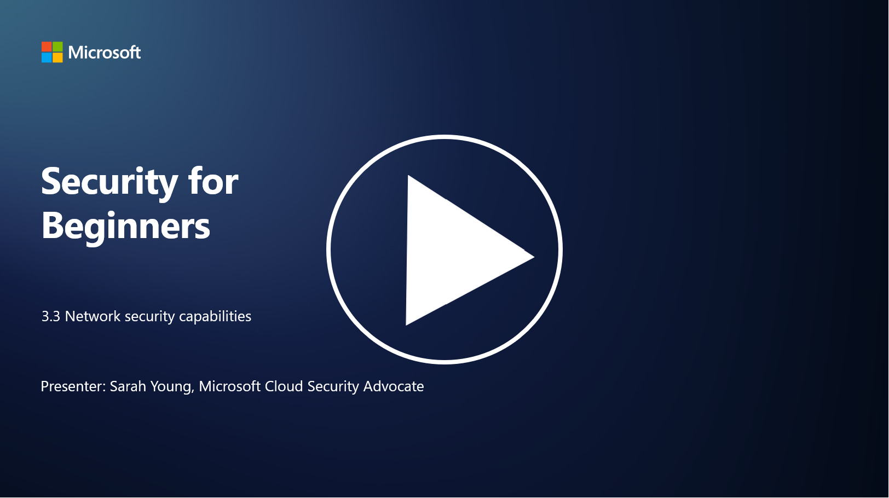

# Ağ Güvenliği Yetenekleri

P.S - Video dili ingilizcedir.

Bu derste, ağı güvence altına almak için kullanılabilecek aşağıdaki yetenekleri öğreneceğiz:

- Geleneksel güvenlik duvarları  
- Web uygulama güvenlik duvarları  
- Bulut güvenlik grupları  
- İçerik Dağıtım Ağı (CDN)  
- Yük dengeleyiciler  
- Bastion sunucuları  
- Sanal Özel Ağlar (VPN'ler)  
- DDoS koruma araçları  

---

## Geleneksel Güvenlik Duvarları

Geleneksel güvenlik duvarları, önceden tanımlanmış güvenlik kurallarına dayalı olarak gelen ve giden ağ trafiğini kontrol eden ve izleyen güvenlik cihazlarıdır. Güvenilir bir iç ağ ile güvenilmeyen dış ağlar arasında bir bariyer görevi görerek, yetkisiz erişimi ve potansiyel tehditleri engeller.

---

## Web Uygulama Güvenlik Duvarları (WAF)

Web Uygulama Güvenlik Duvarları (WAF), web uygulamalarını SQL injection, cross site scripting (XSS) gibi çeşitli saldırılardan ve diğer güvenlik açıklarından korumak için tasarlanmış özel güvenlik duvarlarıdır. WAF'ler, HTTP isteklerini ve yanıtlarını analiz ederek web uygulamalarını hedefleyen kötü niyetli trafiği tespit eder ve engeller.

---

## Bulut Güvenlik Grupları

Güvenlik grupları, bulut hizmet sağlayıcıları tarafından sunulan temel bir ağ güvenliği özelliğidir. Sanal makineler (VM'ler) ve bulut kaynakları için gelen ve giden trafiği kontrol eden sanal güvenlik duvarları olarak işlev görürler. Güvenlik grupları, hangi tür trafiğin izin verileceğini veya reddedileceğini belirleyen kurallar tanımlamaya olanak tanır ve bulut dağıtımlarına ek bir savunma katmanı ekler.

---

## İçerik Dağıtım Ağı (CDN)

İçerik Dağıtım Ağı (CDN), çeşitli coğrafi konumlarda bulunan dağıtılmış bir sunucu ağıdır. CDN'ler, içeriği önbelleğe alarak ve kullanıcıya daha yakın sunuculardan hizmet vererek web sitelerinin performansını ve kullanılabilirliğini artırır. Ayrıca, trafiği birden fazla sunucu konumuna dağıtarak DDoS saldırılarına karşı bir miktar koruma sağlar.

---

## Yük Dengeleyiciler

Yük dengeleyiciler, gelen ağ trafiğini birden fazla sunucuya dağıtarak kaynak kullanımını optimize eder, yüksek kullanılabilirliği sağlar ve uygulama performansını artırır. Sunucu aşırı yüklenmesini önler ve ağın dayanıklılığını artırarak verimli yanıt sürelerini korur.

---

## Bastion Sunucuları

Bastion sunucuları, dışarıdan güvenilmeyen bir ağdan (örneğin, internet) bir ağa kontrollü erişim sağlayan son derece güvenli ve izole edilmiş sunuculardır. Yöneticilerin dahili sistemlere güvenli bir şekilde erişmesini sağlayan giriş noktaları olarak hizmet ederler. Bastion sunucuları genellikle saldırı yüzeyini en aza indirmek için güçlü güvenlik önlemleriyle yapılandırılır.

---

## Sanal Özel Ağlar (VPN'ler)

VPN'ler, bir kullanıcının cihazı ile uzak bir sunucu arasında şifreli tüneller oluşturarak potansiyel olarak güvensiz ağlar (örneğin, internet) üzerinden güvenli ve özel iletişim sağlar. VPN'ler, kullanıcıların dahili ağlara uzaktan erişmesini sağlamak için yaygın olarak kullanılır ve kullanıcıların fiziksel olarak aynı ağdaymış gibi kaynaklara erişmesine olanak tanır.

---

## DDoS Koruma Araçları

DDoS (Dağıtılmış Hizmet Reddi) koruma araçları ve hizmetleri, bir ağı veya hizmeti aşırı yüklemek için birden fazla ele geçirilmiş cihazın kullanıldığı DDoS saldırılarının etkisini azaltmak için tasarlanmıştır. DDoS koruma çözümleri, kötü niyetli trafiği tanımlar ve filtreler, böylece meşru trafiğin hedeflenen varış noktasına ulaşmasını sağlar.

---

## İleri Okuma

- [Güvenlik Duvarı Nedir? - Cisco](https://www.cisco.com/c/en/us/products/security/firewalls/what-is-a-firewall.html#~types-of-firewalls)  
- [Güvenlik Duvarı Aslında Ne Yapar? (howtogeek.com)](https://www.howtogeek.com/144269/htg-explains-what-firewalls-actually-do/)  
- [Güvenlik Duvarı Nedir? Güvenlik Duvarları Nasıl Çalışır ve Türleri (kaspersky.com)](https://www.kaspersky.com/resource-center/definitions/firewall)  
- [Ağ Güvenlik Grubu - Nasıl Çalışır | Microsoft Learn](https://learn.microsoft.com/azure/virtual-network/network-security-group-how-it-works)  
- [Azure İçerik Dağıtım Ağına (CDN) Giriş - Eğitim | Microsoft Learn](https://learn.microsoft.com/training/modules/intro-to-azure-content-delivery-network/?WT.mc_id=academic-96948-sayoung)  
- [İçerik Dağıtım Ağı (CDN) Nedir? - Azure | Microsoft Learn](https://learn.microsoft.com/azure/cdn/cdn-overview?WT.mc_id=academic-96948-sayoung)  
- [Yük Dengeleme Nedir? Yük Dengeleyiciler Nasıl Çalışır (nginx.com)](https://www.nginx.com/resources/glossary/load-balancing/)  
- [Bastion Sunucuları ve VPN'ler · Tailscale](https://tailscale.com/learn/bastion-hosts-vs-vpns/)  
- [VPN Nedir? Nasıl Çalışır, VPN Türleri (kaspersky.com)](https://www.kaspersky.com/resource-center/definitions/what-is-a-vpn)  
- [Azure DDoS Korumasına Giriş - Eğitim | Microsoft Learn](https://learn.microsoft.com/training/modules/introduction-azure-ddos-protection/?WT.mc_id=academic-96948-sayoung)  
- [DDoS Saldırısı Nedir? | Microsoft Security](https://www.microsoft.com/security/business/security-101/what-is-a-ddos-attack?WT.mc_id=academic-96948-sayoung)
