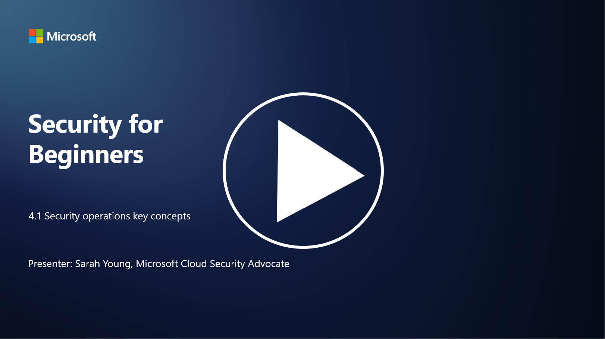

# SecOps (Güvenlik Operasyonları) Temel Kavramları

P.S - Video dili ingilizcedir.

Güvenlik operasyonları, bir organizasyonun genel güvenlik işlevinin kritik bir bileşenidir. Bu derste aşağıdaki konuları öğreneceğiz:

- İşletme içinde güvenlik operasyonları işlevi nedir?  
- Güvenlik operasyonları hangi biçimlerde olabilir?  
- Güvenlik operasyonları, geleneksel BT operasyonlarından nasıl farklıdır?  

---

## İşletme İçinde Güvenlik Operasyonları İşlevi Nedir?

Bir işletme içindeki güvenlik operasyonları işlevi, siber güvenlik tehditlerini ve olaylarını izlemek, tespit etmek, araştırmak ve yanıtlamakla sorumlu özel bir ekip veya departmanı ifade eder. Güvenlik operasyonlarının birincil amacı, organizasyonun dijital varlıklarının gizliliğini, bütünlüğünü ve kullanılabilirliğini sağlamak için güvenlik risklerini proaktif olarak belirlemek, azaltmak ve güvenlik olaylarına etkili bir şekilde yanıt vermektir.

---

## Güvenlik Operasyonları Hangi Biçimlerde Olabilir?

Güvenlik operasyonları, organizasyonun boyutuna ve karmaşıklığına bağlı olarak çeşitli biçimler alabilir. Yaygın biçimler şunlardır:

- **Güvenlik Operasyon Merkezi (SOC):** Güvenlik olaylarını 7/24 izlemek, analiz etmek ve yanıtlamakla sorumlu merkezi bir ekip. SOC'ler genellikle tehditleri gerçek zamanlı olarak tespit etmek ve yanıtlamak için gelişmiş araçlar ve teknolojiler kullanır.

- **Olay Müdahale Ekibi:** Güvenlik olaylarına ve ihlallerine yanıt vermeye odaklanan uzman bir ekip. Bu ekip, soruşturmalar yürütür, müdahale çabalarını koordine eder ve kurtarma süreçlerini kolaylaştırır.

- **Tehdit Avcılığı Ekibi:** Geleneksel güvenlik araçları tarafından tespit edilemeyen gelişmiş tehditlerin ve gizli güvenlik açıklarının izini proaktif olarak süren bir ekip.

- **Red Team/Blue Team:** Red Team saldırıları simüle ederek güvenlik açıklarını belirlerken, Blue Team bu saldırılara karşı savunma yapar. Her iki ekip de güvenlik önlemlerini geliştirmek için birlikte çalışır.

- **Yönetilen Güvenlik Hizmet Sağlayıcısı (MSSP):** Bazı organizasyonlar, güvenlik operasyonlarını güvenlik izleme ve olay müdahalesinde uzmanlaşmış üçüncü taraf sağlayıcılara dış kaynak olarak verir.

---

## Güvenlik Operasyonları, Geleneksel BT Operasyonlarından Nasıl Farklıdır?

Güvenlik operasyonları ve geleneksel BT operasyonları ilişkili ancak farklı işlevlerdir:

- **Odak Noktası:**  
  - BT operasyonları, organizasyonun BT altyapısını yönetmeye ve sürdürmeye, işlevselliğini ve kullanılabilirliğini sağlamaya odaklanır.  
  - Güvenlik operasyonları ise güvenlik risklerini belirlemeye, azaltmaya ve olaylara yanıt vermeye öncelik verir.

- **Sorumluluklar:**  
  - BT operasyonları, sistem bakımı, yazılım güncellemeleri ve kullanıcı desteği gibi görevleri ele alır.  
  - Güvenlik operasyonları, tehdit tespiti, olay müdahalesi, güvenlik açığı yönetimi ve güvenlik izleme gibi görevleri üstlenir.

- **Zamanlama:**  
  - BT operasyonları, sistemlerin hemen kullanılabilirliğini ve performansını vurgular.  
  - Güvenlik operasyonları, tehditleri tespit etmeye ve düzeltmeye odaklanır; bu, her zaman anlık kullanılabilirlikle uyumlu olmayabilir.

- **Beceri Seti:**  
  - Güvenlik operasyonları, tehdit analizi, olay müdahalesi ve siber güvenlik araçlarında uzmanlık gerektirir.  
  - BT operasyonları, sistem yönetimi, ağ yönetimi ve uygulama desteği konularında uzmanlık gerektirir.

---

## Olay Müdahale İş Akışı

NIST Siber Güvenlik Çerçevesi Temel İşlevleri, bir organizasyonun operasyonel ortamında siber güvenlik riskini azaltmak için sürekli olarak gerçekleştirilmesi gereken beş genel işlevi listeler:

Bu faaliyetlerin, organizasyonun daha geniş siber güvenlik süreçleriyle uyumlu ve entegre bir şekilde daha büyük bir döngünün parçası olarak var olması gerektiğini anlamak önemlidir.

**Not:** Daha fazla bilgi için NIST Siber Güvenlik Çerçevesi'ni şu adresten okuyabilirsiniz: [https://www.nist.gov/cybersecurity](https://www.nist.gov/cybersecurity)

---

## İleri Okuma

- [Güvenlik Operasyonları | Microsoft Learn](https://learn.microsoft.com/security/operations/overview?WT.mc_id=academic-96948-sayoung)  
- [Güvenlik Operasyon Süreçlerini Uygulama | Microsoft Learn](https://learn.microsoft.com/security/operations/?WT.mc_id=academic-96948-sayoung)  
- [Güvenlik Operasyon Merkezi (SOC) Nedir? | Microsoft Security](https://www.microsoft.com/security/business/security-101/what-is-a-security-operations-center-soc?WT.mc_id=academic-96948-sayoung)  
- [Güvenlik Operasyon Merkezi Nedir? | CompTIA](https://www.comptia.org/content/articles/what-is-a-security-operations-center)
