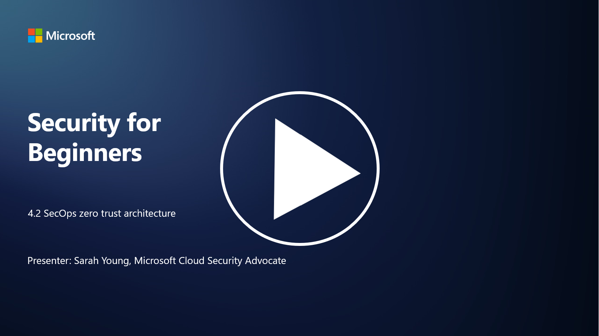

# SecOps ve Sıfır Güven Mimarisi

P.S - Video dili ingilizcedir.

Güvenlik operasyonları, sıfır güven mimarisinin iki önemli parçasını oluşturur. Bu derste aşağıdaki konuları öğreneceğiz:

- Merkezi log toplama için BT mimarileri nasıl inşa edilmelidir?  
- Modern BT ortamlarında güvenlik operasyonları için en iyi uygulamalar nelerdir?  

---

## Merkezi Log Toplama için BT Mimarileri Nasıl İnşa Edilmelidir?

Merkezi log toplama, modern güvenlik operasyonlarının kritik bir bileşenidir. Bu, organizasyonların sunucular, uygulamalar, ağ cihazları ve güvenlik araçları gibi çeşitli kaynaklardan gelen logları bir merkezde toplayarak analiz, izleme ve olay müdahalesi için kullanmalarını sağlar. Merkezi log toplama için BT mimarilerini destekleyecek en iyi uygulamalar şunlardır:

1. **Log Kaynağı Entegrasyonu**:  
   - Tüm ilgili cihazların ve sistemlerin log üretmek üzere yapılandırıldığından emin olun. Bu, sunucular, güvenlik duvarları, yönlendiriciler, anahtarlar, uygulamalar ve güvenlik cihazlarını içerir.  
   - Log kaynaklarını, logları merkezi bir log toplayıcıya veya yönetim sistemine iletecek şekilde yapılandırın.

2. **Doğru SIEM Aracını Seçin**:  
   - Organizasyonunuzun ihtiyaçlarına ve ölçeğine uygun bir SIEM (Güvenlik Bilgisi ve Olay Yönetimi) çözümü seçin.  
   - Seçilen çözümün log toplama, birleştirme, analiz ve raporlama işlevlerini desteklediğinden emin olun.

3. **Ölçeklenebilirlik ve Yedeklilik**:  
   - Artan log kaynakları ve log hacmini karşılamak için mimariyi ölçeklenebilir şekilde tasarlayın.  
   - Donanım veya ağ arızalarından kaynaklanan kesintileri önlemek için yüksek erişilebilirlik sağlayan yedeklilik uygulayın.

4. **Logların Güvenli Taşınması**:  
   - Logların kaynaklardan merkezi depoya taşınması için TLS/SSL veya IPsec gibi güvenli protokoller kullanın.  
   - Yalnızca yetkili cihazların log gönderebilmesini sağlamak için kimlik doğrulama ve erişim kontrolleri uygulayın.

5. **Normalleştirme**:  
   - Log formatlarını standartlaştırın ve verileri analiz kolaylığı için normalleştirin.

6. **Depolama ve Saklama**:  
   - Logların saklama süresini, uyumluluk ve güvenlik gereksinimlerine göre belirleyin.  
   - Logları yetkisiz erişim ve manipülasyondan koruyarak güvenli bir şekilde depolayın.

---

## Modern BT Ortamlarında Güvenlik Operasyonları için En İyi Uygulamalar

Merkezi log toplamanın yanı sıra, modern BT ortamlarında güvenlik operasyonları için aşağıdaki en iyi uygulamalar önerilir:

1. **Sürekli İzleme**:  
   - Ağ ve sistem aktivitelerini sürekli izleyerek tehditleri gerçek zamanlı olarak tespit edin ve yanıt verin.

2. **Tehdit İstihbaratı**:  
   - Tehdit istihbarat akışlarını ve hizmetlerini kullanarak ortaya çıkan tehditler ve güvenlik açıkları hakkında bilgi sahibi olun.

3. **Kullanıcı Eğitimi**:  
   - Sosyal mühendislik ve oltalama saldırılarıyla ilişkili riskleri azaltmak için düzenli güvenlik farkındalık eğitimleri düzenleyin.

4. **Olay Müdahale Planı**:  
   - Güvenlik olaylarına hızlı ve etkili bir şekilde yanıt vermek için bir olay müdahale planı geliştirin ve test edin.

5. **Güvenlik Otomasyonu**:  
   - Olay müdahalesi ve tekrarlayan görevleri kolaylaştırmak için güvenlik otomasyonu ve orkestrasyon araçlarından yararlanın.

6. **Yedekleme ve Kurtarma**:  
   - Veri kaybı veya fidye yazılımı saldırıları durumunda veri kullanılabilirliğini sağlamak için sağlam yedekleme ve felaket kurtarma çözümleri uygulayın.

---

## İleri Okuma

- [Microsoft Güvenlik En İyi Uygulamaları Modülü: Güvenlik Operasyonları | Microsoft Learn](https://learn.microsoft.com/security/operations/security-operations-videos-and-decks?WT.mc_id=academic-96948-sayoung)  
- [Güvenlik Operasyonları - Bulut Benimseme Çerçevesi | Microsoft Learn](https://learn.microsoft.com/azure/cloud-adoption-framework/secure/security-operations?WT.mc_id=academic-96948-sayoung)  
- [Güvenlik Operasyonları ve Analitik Platform Mimarisi Nedir? (digitalguardian.com)](https://www.digitalguardian.com/blog/what-security-operations-and-analytics-platform-architecture-definition-soapa-how-it-works#:~:text=All%20in%20all%2C%20security%20operations%20and%20analytics%20platform,become%20more%20efficient%20and%20operative%20with%20your%20security.)
