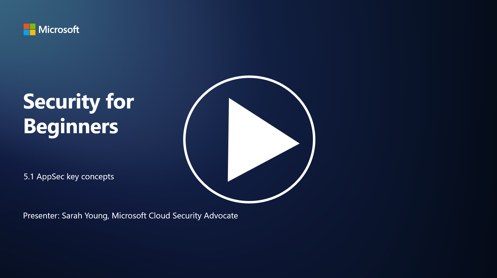

# AppSec (Uygulama Güvenliği) Temel Kavramları

Uygulama güvenliği, başlı başına bir güvenlik uzmanlık alanıdır. Bu bölümde, uygulama güvenliği hakkında daha fazla bilgi edineceğiz.

P.S - Video dili ingilizcedir.

---

## Giriş

Bu derste şunları ele alacağız:

- Uygulama güvenliği nedir?  
- Uygulama güvenliğinin temel kavramları/prensipleri nelerdir?  

---

## Uygulama Güvenliği Nedir?

Uygulama güvenliği, genellikle "AppSec" olarak kısaltılır ve yazılım uygulamalarını güvenlik tehditlerinden, güvenlik açıklarından ve saldırılardan koruma pratiğini ifade eder. Uygulama güvenliği, bir uygulamanın geliştirme, dağıtım ve bakım yaşam döngüsü boyunca güvenlik risklerini tanımlamak, azaltmak ve önlemek için kullanılan süreçleri, teknikleri ve araçları kapsar.

Uygulama güvenliği kritik bir öneme sahiptir çünkü uygulamalar siber saldırılar için yaygın hedeflerdir. Kötü niyetli aktörler, yazılımdaki güvenlik açıklarını ve zayıflıkları kullanarak yetkisiz erişim elde eder, veri çalar, hizmetleri kesintiye uğratır veya diğer kötü niyetli faaliyetleri gerçekleştirir. Etkili uygulama güvenliği, bir uygulamanın ve ilişkili verilerinin gizliliğini, bütünlüğünü ve kullanılabilirliğini sağlamaya yardımcı olur.

---

## Uygulama Güvenliğinin Temel Kavramları/Prensipleri Nelerdir?

Uygulama güvenliğini destekleyen temel kavramlar ve prensipler şunlardır:

1. **Tasarımda Güvenlik (Secure by Design)**:  
   - Güvenlik, uygulamanın tasarımına ve mimarisine en başından entegre edilmelidir; sonradan eklenmemelidir.

2. **Girdi Doğrulama (Input Validation)**:  
   - Tüm kullanıcı girdileri, beklenen formatlara uygun olduğundan ve kötü niyetli kod veya veri içermediğinden emin olmak için doğrulanmalıdır.

3. **Çıktı Kodlama (Output Encoding)**:  
   - İstemciye gönderilen veriler, çapraz site betikleme (XSS) gibi güvenlik açıklarını önlemek için uygun şekilde kodlanmalıdır.

4. **Kimlik Doğrulama ve Yetkilendirme (Authentication and Authorization)**:  
   - Kullanıcıları kimlik doğrulama ile doğrulayın ve kaynaklara erişimlerini rollerine ve izinlerine göre yetkilendirin.

5. **Veri Koruma (Data Protection)**:  
   - Hassas veriler, yetkisiz erişimi önlemek için depolanırken, iletilirken ve işlenirken şifrelenmelidir.

6. **Oturum Yönetimi (Session Management)**:  
   - Güvenli oturum yönetimi, kullanıcı oturumlarının ele geçirilmesini ve yetkisiz erişimi önler.

7. **Güvenli Bağımlılıklar (Secure Dependencies)**:  
   - Yazılım bağımlılıklarını güvenlik yamalarıyla güncel tutarak güvenlik açıklarını önleyin.

8. **Hata Yönetimi ve Loglama (Error Handling and Logging)**:  
   - Hassas bilgilerin açığa çıkmasını önlemek için güvenli hata yönetimi uygulayın ve güvenli loglama uygulamalarını benimseyin.

9. **Güvenlik Testi (Security Testing)**:  
   - Penetrasyon testleri, kod incelemeleri ve otomatik tarama araçları gibi yöntemlerle uygulamaları düzenli olarak güvenlik açıklarına karşı test edin.

10. **Güvenli Yazılım Geliştirme Yaşam Döngüsü (Secure SDLC)**:  
    - Güvenlik uygulamalarını, gereksinimlerden dağıtım ve bakıma kadar yazılım geliştirme yaşam döngüsünün her aşamasına entegre edin.

---

## İleri Okuma

- [SheHacksPurple: Uygulama Güvenliği Nedir? - YouTube](https://www.youtube.com/watch?v=eNmccQNzSSY)  
- [Uygulama Güvenliği Nedir? - Cisco](https://www.cisco.com/c/en/us/solutions/security/application-first-security/what-is-application-security.html#~how-does-it-work)  
- [Uygulama Güvenliği Nedir? Yazılım Güvenliği için Süreç ve Araçlar | CSO Online](https://www.csoonline.com/article/566471/what-is-application-security-a-process-and-tools-for-securing-software.html)  
- [OWASP Cheat Sheet Serisi | OWASP Foundation](https://owasp.org/www-project-cheat-sheets/)
