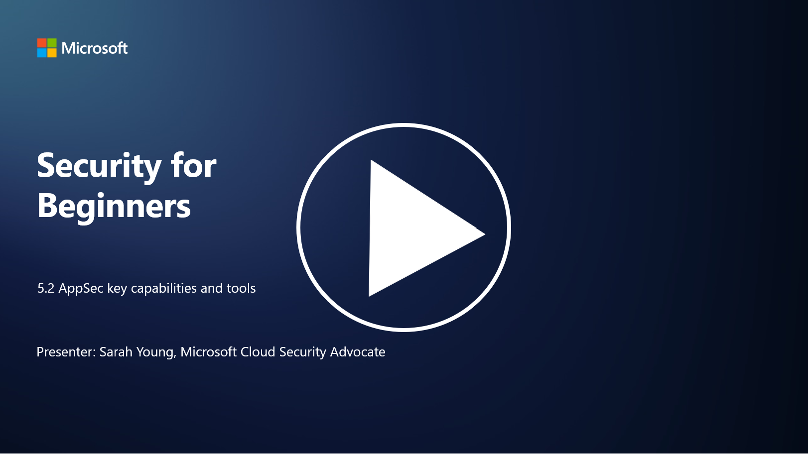

# AppSec Yetenekleri

Bu bölümde, uygulama güvenliğinde kullanılan temel araçlar ve yetenekler hakkında daha fazla ayrıntı ele alacağız.

P.S - Video dili ingilizcedir.

---

## Giriş

Bu derste, uygulama güvenliğinde kullanılan temel yetenekler ve araçların neler olduğunu inceleyeceğiz.

---

## Uygulama Güvenliğinin Temel Yetenekleri ve Araçları

Uygulama güvenliğinde kullanılan temel yetenekler ve araçlar, yazılım uygulamalarındaki güvenlik açıklarını ve tehditleri tanımlamak, azaltmak ve önlemek için kritik öneme sahiptir. İşte en önemli yetenekler ve araçlar:

### **1. Statik Uygulama Güvenliği Testi (SAST)**

- **Yetenekler**: Kaynak kodu, bayt kodu veya ikili kodu analiz ederek uygulamanın kod tabanındaki güvenlik açıklarını tespit eder.  
- **Araçlar**: Fortify, Checkmarx, Veracode.

---

### **2. Dinamik Uygulama Güvenliği Testi (DAST)**

- **Yetenekler**: Çalışan bir uygulamayı tarayarak, giriş istekleri gönderip yanıtları analiz ederek güvenlik açıklarını tespit eder.  
- **Araçlar**: ZAP, Burp Suite, Qualys Web Application Scanning.

---

### **3. Etkileşimli Uygulama Güvenliği Testi (IAST)**

- **Yetenekler**: SAST ve DAST unsurlarını birleştirerek kodu çalışma zamanında analiz eder, daha doğru sonuçlar sağlar ve yanlış pozitifleri azaltır.  
- **Araçlar**: Contrast Security, HCL AppScan.

---

### **4. Çalışma Zamanı Uygulama Kendini Koruma (RASP)**

- **Yetenekler**: Uygulamaları gerçek zamanlı olarak izler ve korur, güvenlik tehditlerini meydana geldikçe tespit eder ve yanıtlar.  
- **Araçlar**: Veracode Runtime Protection, F5 Advanced WAF with RASP.

---

### **5. Web Uygulama Güvenlik Duvarları (WAFs)**

- **Yetenekler**: Uygulama ile internet arasında koruyucu bir katman sağlar, gelen trafiği filtreler ve kötü niyetli istekleri engeller.  
- **Araçlar**: ModSecurity, AWS WAF, Akamai Kona Site Defender.

---

### **6. Bağımlılık Taraması (Dependency Scanning)**

- **Yetenekler**: Uygulamada kullanılan üçüncü taraf kütüphanelerdeki ve bileşenlerdeki güvenlik açıklarını tespit eder.  
- **Araçlar**: OWASP Dependency-Check, Snyk.

---

### **7. Penetrasyon Testi (Pen Testing)**

- **Yetenekler**: Gerçek dünya saldırılarını simüle ederek güvenlik açıklarını keşfeder ve bir uygulamanın güvenliğini değerlendirir.  
- **Araçlar**: Metasploit, Nmap.

---

### **8. Güvenlik Taraması ve Analizi**

- **Yetenekler**: Bilinen güvenlik açıklarını, yapılandırma hatalarını ve güvenlik yanlış yapılandırmalarını tarar.  
- **Araçlar**: Nessus, Qualys Vulnerability Management, OpenVAS.

---

### **9. Konteyner Güvenlik Araçları**

- **Yetenekler**: Konteynerleştirilmiş uygulamaları ve ortamlarını güvence altına alır.  
- **Araçlar**: Docker Security Scanning, Aqua Security.

---

### **10. Güvenli Geliştirme Eğitimi**

- **Yetenekler**: Geliştirme ekiplerine güvenli kodlama uygulamalarını teşvik etmek için eğitim ve farkındalık programları sağlar.  
- **Araçlar**: Özelleştirilmiş eğitim programları ve platformlar.

---

### **11. Güvenlik Testi Çerçeveleri**

- **Yetenekler**: Farklı uygulama güvenliği test ihtiyaçları için kapsamlı test çerçeveleri sağlar.  
- **Araçlar**: OWASP Amass, OWASP OWTF, FrAppSec.

---

### **12. Güvenli Kod İnceleme Araçları**

- **Yetenekler**: Kaynak kodunu güvenlik açıkları ve kodlama en iyi uygulamaları açısından inceler.  
- **Araçlar**: SonarQube, Checkmarx.

---

### **13. Güvenli API'ler ve Mikro Hizmet Araçları**

- **Yetenekler**: API'leri ve mikro hizmetleri güvence altına alır; kimlik doğrulama, yetkilendirme ve veri koruma sağlar.  
- **Araçlar**: Apigee, AWS API Gateway, Istio.

---

## İleri Okuma

- [Uygulama Güvenliği Nedir? Kavramlar, Araçlar ve En İyi Uygulamalar | HackerOne](https://www.hackerone.com/knowledge-center/what-application-security-concepts-tools-best-practices)  
- [IAST Nedir? (Etkileşimli Uygulama Güvenliği Testi) (comparitech.com)](https://www.comparitech.com/net-admin/what-is-iast/)  
- [10 Tür Uygulama Güvenliği Test Aracı: Ne Zaman ve Nasıl Kullanılır? (cmu.edu)](https://insights.sei.cmu.edu/blog/10-types-of-application-security-testing-tools-when-and-how-to-use-them/)  
- [Siber Güvenlik Risk Dengesini Değiştirmek: Tasarım ve Varsayılan Güvenlik için Prensipler ve Yaklaşımlar | Cyber.gov.au](https://www.cyber.gov.au/about-us/view-all-content/publications/principles-and-approaches-for-security-by-design-and-default)
