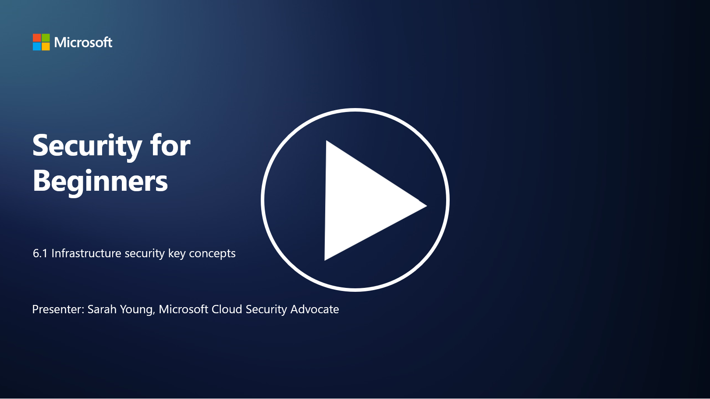

# Altyapı Güvenliğinin Temel Kavramları

P.S - Video dili ingilizcedir.

"Altyapı," herhangi bir BT ortamının yapı taşlarını ifade eder ve sunucular, bulut hizmetleri ve konteynerler gibi birçok farklı teknolojiyi içerir. Önceki bölümde ele alınan uygulamalar altyapı üzerinde çalışır, bu nedenle altyapı da saldırganlar tarafından hedef alınabilir.

Bu derste şunları ele alacağız:

- Güvenlik hijyeni nedir ve neden önemlidir?  
- Güvenlik durumu yönetimi nedir?  
- Yama yönetimi nedir ve neden önemlidir?  
- Konteynerler nedir ve güvenlikleri neden farklıdır?  

---

## Güvenlik Hijyeni Nedir ve Neden Önemlidir?

**Güvenlik hijyeni**, bireylerin ve kuruluşların iyi siber güvenlik alışkanlıklarını sürdürmek için izlediği uygulamalar ve davranışlar bütünüdür. Sistemleri, verileri ve ağları tehditlerden ve güvenlik açıklarından korumak için adımlar atmayı içerir. İyi güvenlik hijyeni birkaç nedenden dolayı önemlidir:

- **Saldırıları Önleme**: En iyi uygulamaları takip etmek, kimlik avı, kötü amaçlı yazılım enfeksiyonları ve yetkisiz erişim gibi yaygın siber saldırıları önleyebilir.  
- **Veri Koruma**: Doğru güvenlik hijyeni, hassas ve gizli verileri hırsızlık veya ifşadan korur.  
- **Güven Sağlama**: İyi güvenlik hijyeni sergileyen kuruluşlar, müşteriler ve iş ortaklarıyla güven inşa eder.  
- **Uyumluluk**: Birçok düzenleme ve standart, kuruluşların güvenlik hijyeni uygulamalarını takip etmesini gerektirir.  
- **Risk Azaltma**: Tutarlı güvenlik hijyeni, güvenlik olayları ve ihlallerin genel riskini azaltır.  

Güvenlik hijyeni, yazılımları güncel tutmak, güçlü şifreler ve çok faktörlü kimlik doğrulama kullanmak, düzenli yedeklemeler yapmak, çalışanları eğitmek ve şüpheli etkinlikleri izlemek gibi uygulamaları içerir. Güçlü bir siber güvenlik duruşunun temelidir.

---

## Güvenlik Durumu Yönetimi Nedir?

**Güvenlik Durumu Yönetimi (Security Posture Management)**, bir kuruluşun genel siber güvenlik duruşunu değerlendirme, izleme ve yönetme pratiğidir. Siber güvenlik duruşu, bir kuruluşun BT sistemlerini, ağlarını, verilerini ve varlıklarını siber tehditlerden ve saldırılardan koruma konusundaki genel yaklaşımını ve hazırlığını ifade eder. Şunları kapsar:

- Stratejiler, politikalar, uygulamalar ve teknolojiler.  
- Dijital varlıkları koruma ve bilgilerin gizliliğini, bütünlüğünü ve kullanılabilirliğini sağlama.  

Güvenlik durumu yönetimi, sistemlerin, ağların, uygulamaların ve verilerin güvenliğini değerlendirmeyi ve sürdürmeyi içerir. Bu, güvenlik politikalarına, en iyi uygulamalara ve uyumluluk gereksinimlerine uygunluğu sağlamayı hedefler. SPM, bir kuruluşun güvenlik durumuna kapsamlı bir bakış sunar, güvenlik açıklarını ve zayıflıkları belirler ve iyileştirme çabalarını önceliklendirir.

---

## Yama Yönetimi Nedir ve Neden Önemlidir?

**Yama yönetimi**, yazılımlara, işletim sistemlerine ve uygulamalara yamalar veya düzeltmeler olarak bilinen yazılım güncellemelerini uygulama sürecini ifade eder. Bu güncellemeler genellikle güvenlik açıklarını, hataları ve saldırganlar tarafından istismar edilebilecek diğer sorunları giderir. Donanım cihazları da yama gerektirir; bu, cihazların donanım yazılımı veya yerleşik işletim sistemi olabilir. Donanım yamaları, yazılım yamalarına göre daha zor olabilir.

Yama yönetimi şu nedenlerle önemlidir:

- **Güvenlik**: Yamalar, saldırganların sistemleri ele geçirmek ve veri çalmak için kullanabileceği bilinen güvenlik açıklarını düzeltir.  
- **Kararlılık**: Yamalar genellikle kararlılık ve performans iyileştirmeleri içerir, çökme veya sistem arızası riskini azaltır.  
- **Uyumluluk**: Birçok düzenleme ve uyumluluk standardı, kuruluşların güvenlik yamalarını zamanında uygulamasını gerektirir.  
- **Güven Sağlama**: Düzenli yama yönetimi, müşterilerin ve paydaşların güvenini korumaya yardımcı olur.  
- **Risk Azaltma**: Yama yönetimi, saldırı yüzeyini ve başarılı siber saldırı olasılığını azaltır.  

Yamaları zamanında uygulamamak, sistemleri bilinen açıklar karşısında savunmasız bırakabilir ve güvenlik ihlalleri ile veri kaybı riskini artırabilir.

---

## Konteynerler Nedir ve Güvenlikleri Neden Farklıdır?

**Konteynerler**, bir yazılım parçasını çalıştırmak için gereken her şeyi (kod, çalışma zamanı, kütüphaneler ve sistem araçları dahil) içeren hafif, bağımsız ve çalıştırılabilir yazılım paketleridir. Konteynerler, uygulamalar için tutarlı ve izole bir ortam sağlar, bu da yazılımı farklı ortamlar ve platformlar arasında geliştirmeyi, paketlemeyi ve dağıtmayı kolaylaştırır. Popüler konteyner teknolojileri arasında Docker ve Kubernetes bulunur.

**Konteyner Güvenliği**, konteynerleri ve barındırdıkları uygulamaları çeşitli güvenlik tehditlerinden ve açıklarından korumak için kullanılan uygulamalar ve teknolojileri ifade eder. Konteyner güvenliği önemlidir çünkü konteynerler taşınabilirlik ve ölçeklenebilirlik açısından birçok avantaj sunsa da, potansiyel güvenlik zorlukları da getirir:

1. **Görüntü Güvenliği**:  
   - Konteyner görüntüleri güvenlik açıkları içerebilir. Bu görüntüler düzenli olarak güncellenmez ve yamalanmazsa saldırganlar tarafından istismar edilebilir. Güvenlik, görüntülerin taranmasını ve yalnızca güvenilir görüntülerin kullanılmasını içerir.  

2. **Çalışma Zamanı Güvenliği**:  
   - Çalışan konteynerler, birbirlerinden ve ana sistemden izole edilmelidir. Çalışma zamanı güvenliği, ad alanları (namespaces) ve cgroups gibi konteyner izolasyon teknolojilerini ve konteyner davranışını izlemek ve denetlemek için araçları içerir.  

3. **Ağ Güvenliği**:  
   - Konteynerler, ağlar üzerinden birbirleriyle ve harici sistemlerle iletişim kurar. Uygun ağ segmentasyonu ve güvenlik duvarı kuralları, konteynerler arasındaki trafiği kontrol etmek ve yetkisiz erişimi önlemek için gereklidir.  

4. **Erişim Kontrolü**:  
   - Yalnızca yetkili kullanıcıların ve süreçlerin konteynerlere erişebilmesi ve bunları değiştirebilmesi sağlanmalıdır. Rol tabanlı erişim kontrolü (RBAC) ve kimlik yönetimi araçları genellikle kullanılır.  

5. **Loglama ve İzleme**:  
   - Konteyner güvenliği, günlüklerin toplanmasını ve analiz edilmesini, ayrıca güvenlik olaylarını ve anormallikleri gerçek zamanlı olarak tespit etmek ve yanıtlamak için izlemeyi içerir.  

6. **Orkestrasyon Güvenliği**:  
   - Kubernetes gibi konteyner orkestrasyon platformları kullanıldığında, orkestrasyon katmanının güvenliği de önemlidir. Bu, Kubernetes API sunucusunun güvenliğini sağlamak, uygun RBAC politikalarını uygulamak ve küme etkinliğini denetlemek gibi unsurları içerir.  

7. **Gizli Bilgi Yönetimi**:  
   - API anahtarları ve şifreler gibi hassas bilgilerin konteynerlerde güvenli bir şekilde saklanması ve yönetilmesi gereklidir.  

Konteyner güvenliği çözümleri genellikle güvenlik en iyi uygulamalarını, güvenlik açığı tarama araçlarını, çalışma zamanı koruma mekanizmalarını, ağ güvenliği yapılandırmalarını ve konteyner orkestrasyon güvenlik özelliklerini içerir. Sürekli izleme ve otomasyon, konteynerleştirilmiş uygulamalar geliştikçe ve ölçeklendikçe tehditleri hızlı bir şekilde tespit etmek ve yanıtlamak için kritik öneme sahiptir.

---

## İleri Okuma

- [Güvenlik Hijyeninin Önemi | Security Magazine](https://www.securitymagazine.com/articles/99510-the-importance-of-security-hygiene)  
- [CSPM Nedir? | Microsoft Security](https://www.microsoft.com/security/business/security-101/what-is-cspm?WT.mc_id=academic-96948-sayoung)  
- [Bulut Güvenlik Durumu Yönetimi (CSPM) Nedir? | HackerOne](https://www.hackerone.com/knowledge-center/what-cloud-security-posture-management)  
- [Bulut Güvenlik Durumu Yönetiminin İşlevi - Microsoft Learn](https://learn.microsoft.com/azure/cloud-adoption-framework/organize/cloud-security-posture-management?WT.mc_id=academic-96948-sayoung)  
- [CNAPP Nedir? | Microsoft Security](https://www.microsoft.com/security/business/security-101/what-is-cnapp)  
- [Herkes Neden CNAPP Hakkında Konuşuyor? (forbes.com)](https://www.forbes.com/sites/forbestechcouncil/2021/12/10/why-everyone-is-talking-about-cnapp/?sh=567275ca1549)  
- [Yama Yönetimi Siber Güvenlik için Neden Önemlidir? - CyberSmart](https://cybersmart.co.uk/blog/why-is-patching-important-to-cybersecurity/)  
- [Konteyner Güvenliği Nedir? 2023 Rehberi (aquasec.com)](https://www.aquasec.com/cloud-native-academy/container-security/container-security/)
