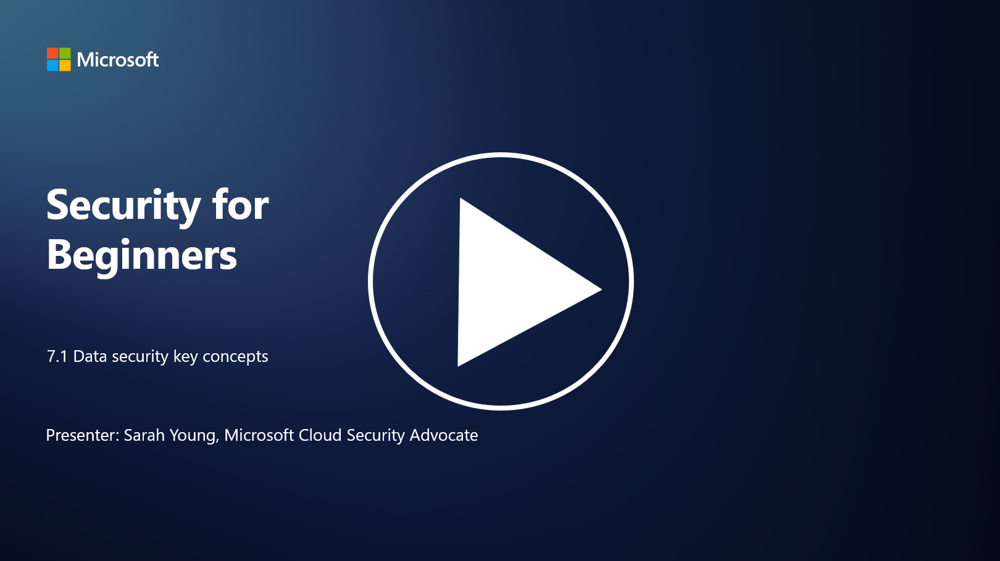

# Veri Güvenliğinin Temel Kavramları

Bu derste veri güvenliği konusunu daha derinlemesine inceleyeceğiz. Bu derste şunları öğreneceksiniz:

- Veri güvenliği nedir?  
- Veri sınıflandırması nedir?  
- Veri yaşam döngüsü yönetimi nedir?  
- Veri kaybını önleme (DLP) nedir?  
- Veri güvenliği bir organizasyon için neden önemlidir?  

P.S - Video dili ingilizcedir.

---

## Veri Güvenliği Nedir?

**Veri güvenliği**, dijital verilerin (örneğin, veritabanları, dosyalar ve hassas bilgiler) yetkisiz erişim, ifşa, değiştirme veya yok edilmeden korunması uygulamasını ifade eder. Veri güvenliğinin birincil amacı, verilerin gizliliğini, bütünlüğünü ve kullanılabilirliğini sağlamaktır. Bu, siber saldırılar, iç tehditler ve veri ihlalleri gibi çeşitli tehditlere ve güvenlik açıklarına karşı verileri korumak için teknik, idari ve fiziksel güvenlik önlemlerinin bir kombinasyonunu uygulamayı içerir. Veri güvenliği önlemleri şunları içerebilir: şifreleme, erişim kontrolleri, kimlik doğrulama, denetim izleri ve güvenlik politikaları.

---

## Veri Sınıflandırması Nedir?

**Veri sınıflandırması**, verilerin hassasiyetine, değerine ve bir organizasyon için önemine göre kategorilere ayrılması sürecidir. Veri sınıflandırmasının amacı, organizasyonların farklı veri türlerinin korunması ve işlenmesi için öncelik belirlemesine yardımcı olmaktır. Yaygın veri sınıflandırma kategorileri şunlardır: "genel," "dahili," "gizli" ve "kısıtlı" veya "çok gizli." Veriler sınıflandırıldıktan sonra, organizasyonlar hassas verilerin yeterince korunmasını ve düzenleyici gerekliliklere uyumun sağlanmasını temin etmek için uygun güvenlik kontrolleri ve erişim kısıtlamaları uygulayabilir.

---

## Veri Yaşam Döngüsü Yönetimi Nedir?

**Veri yaşam döngüsü yönetimi**, verilerin oluşturulmasından veya edinilmesinden arşivlenmesine veya silinmesine kadar tüm yaşam döngüsü boyunca yönetilmesi için yapılandırılmış bir yaklaşımdır. Veri yaşam döngüsü genellikle şu aşamalardan oluşur: oluşturma, depolama, işleme, iletim, arşivleme ve imha. Veri yaşam döngüsü yönetimi, verilerin yaşam döngüsünün her aşaması için politikalar ve prosedürler tanımlamayı içerir. Bu, veri saklama, erişim kontrolleri, yedeklemeler ve veri temizleme gibi süreçleri kapsar. Etkili veri yaşam döngüsü yönetimi, organizasyonların veri depolamayı optimize etmesine, veri kalitesini artırmasına ve veri koruma düzenlemelerine uyumu sağlamasına yardımcı olur.

---

## Veri Kaybını Önleme (DLP) Nedir?

**Veri Kaybını Önleme (DLP)**, hassas veya gizli verilerin yetkisiz erişimini, paylaşımını veya sızmasını önlemek için tasarlanmış bir dizi teknoloji, politika ve uygulamayı ifade eder. DLP çözümleri, içerik incelemesi ve bağlamsal analiz kullanarak hareket halindeki verileri (örneğin, e-posta, web trafiği), hareketsiz verileri (örneğin, depolanan dosyalar ve veritabanları) ve kullanım halindeki verileri (örneğin, kullanıcılar tarafından erişilen veya işlenen veriler) izler ve kontrol eder. DLP'nin amacı, veri ihlallerini önlemek, veri koruma düzenlemelerine uyumu sağlamak ve bir organizasyonun itibarını korumaktır. DLP çözümleri, hassas verileri tanımlayarak ve engelleyerek veya şifreleyerek veri kaybını önler.

---

## Veri Güvenliği Bir Organizasyon İçin Neden Önemlidir?

Veri güvenliği, organizasyonlar için birkaç nedenden dolayı kritik öneme sahiptir:

- **Hassas Bilgilerin Korunması**: Organizasyonlar genellikle müşteri kayıtları, fikri mülkiyet, finansal veriler ve çalışan bilgileri gibi hassas verileri depolar. Veri güvenliği, bu hassas bilgileri yetkisiz erişim veya hırsızlıktan korur.  
- **Uyumluluk**: Birçok sektör ve yargı bölgesi, katı veri koruma ve gizlilik düzenlemelerine sahiptir. Veri güvenliği, organizasyonların bu yasalara uymasına yardımcı olur ve yasal cezalar ile itibar kaybını önler.  
- **Veri İhlallerinin Önlenmesi**: Veri ihlalleri, finansal kayıplara, itibar zedelenmesine ve yasal sonuçlara yol açabilir. Etkili veri güvenliği önlemleri, veri ihlallerini önlemeye veya etkilerini sınırlamaya yardımcı olur.  
- **Güvenin Korunması**: Müşteriler ve paydaşlar, organizasyonlara verilerini emanet eder. Veri güvenliği ihlalleri, bu güveni zedeler. Güçlü veri güvenliğini sürdürmek, güveni ve müşteri güvenini korur.  
- **Rekabet Avantajı**: Veri güvenliğine bağlılık göstermek, rekabet avantajı sağlayabilir. Müşteriler ve iş ortakları, veri güvenliğini ciddiye alan organizasyonlarla çalışmayı tercih eder.  
- **Operasyonel Süreklilik**: Veri güvenliği önlemleri, veri yedeklemeleri ve felaket kurtarma planlaması dahil olmak üzere, kritik verilerin kullanılabilirliğini ve veri kaybı veya felaket durumunda iş sürekliliğini sağlar.  
- **İç Tehditlere Karşı Koruma**: Veri güvenliği önlemleri, çalışanlar tarafından kazara veri ifşası ve içeriden gelen kötü niyetli eylemler gibi organizasyon içindeki tehditleri de ele alır.  

Sonuç olarak, veri güvenliği, hassas bilgilerin korunması, düzenlemelere uyum, veri ihlallerinin önlenmesi, güvenin korunması ve bir organizasyonun devam eden başarısı ve itibarı için hayati öneme sahiptir.

---

## İleri Okuma

- [Veri Güvenliği Nedir? | Microsoft Security](https://www.microsoft.com/en-au/security/business/security-101/what-is-data-security?WT.mc_id=academic-96948-sayoung)  
- [Belgeleri ve Verileri Otomatik Olarak Sınıflandırın ve Koruyun | Microsoft Purview Information Protection](https://youtu.be/v8LqmzBUaOo)  
- [Örnek Veri Sınıflandırma Politikası](https://www.cmu.edu/data/guidelines/data-classification.html)  
- [Veri Güvenliği Nedir? Veri Güvenliği Tanımı ve Genel Bakış | IBM](https://www.ibm.com/topics/data-security)  
- [Veri Yaşam Döngüsü Yönetimi: İşletmeniz İçin 2023 Rehberi (cloudwards.net)](https://www.cloudwards.net/data-lifecycle-management/)  
- [Veri Kaybını Önleme (DLP) Nedir? | Microsoft Security](https://www.microsoft.com/security/business/security-101/what-is-data-loss-prevention-dlp?WT.mc_id=academic-96948-sayoung)  
- [DLP Nedir? Veri Kaybını Önleme Yazılımı Nasıl Çalışır ve Neden Gerekli? | CSO Online](https://www.csoonline.com/article/569559/what-is-dlp-how-data-loss-prevention-software-works-and-why-you-need-it.html)
