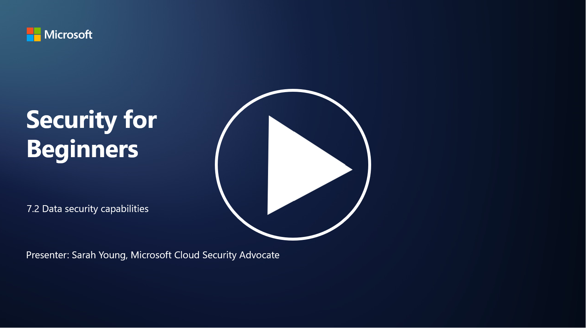

# Veri Güvenliği Yetenekleri

Bu bölümde, veri güvenliğinde kullanılan temel araçlar ve yetenekler hakkında daha fazla ayrıntı ele alacağız.

P.S - Video dili ingilizcedir.

---

## Giriş

Bu derste şunları ele alacağız:

- Veri kaybını önleme araçları nedir?  
- İç tehdit yönetimi araçları nedir?  
- Hangi veri saklama araçları mevcuttur?  

---

## Veri Kaybını Önleme Araçları Nedir?

**Veri Kaybını Önleme (DLP) araçları**, bir organizasyon içinde hassas veya gizli verilerin yetkisiz erişimini, paylaşımını veya sızmasını önlemek için tasarlanmış yazılım çözümleri ve teknolojileri ifade eder. Bu araçlar, içerik inceleme, politika uygulama ve izleme kullanarak hassas verileri tespit eder ve korur. Örnek DLP ürünleri şunlardır:

- **Symantec Data Loss Prevention**  
- **McAfee Total Protection for Data Loss Prevention**  
- **Microsoft 365 DLP**: Microsoft 365 uygulamalarıyla entegre çalışarak organizasyonların e-postalar, belgeler ve mesajlar içindeki hassas verileri tanımlamasına ve korumasına yardımcı olur.  

---

## İç Tehdit Yönetimi Araçları Nedir?

**İç Tehdit Yönetimi araçları**, çalışanlar, yükleniciler veya iş ortakları tarafından kasıtlı veya kasıtsız olarak veri güvenliğinin tehlikeye atılmasını önlemek için organizasyonlara yardımcı olur. Bu araçlar, kullanıcı davranışlarını, erişim modellerini ve veri kullanımını izleyerek şüpheli etkinlikleri ve potansiyel iç tehditleri tespit eder. Örnek iç tehdit yönetimi ürünleri şunlardır:

- **Microsoft Insider Risk Management** (Microsoft 365'in bir parçası)  
- **Forcepoint Insider Threat Data Protection**  
- **Varonis Insider Threat Detection**  

---

## Hangi Veri Saklama Araçları Mevcuttur?

**Veri saklama araçları**, bir organizasyonun veri saklama politikalarına ve yasal gerekliliklere uygun olarak verilerin saklanmasını ve silinmesini yönetmek için tasarlanmış yazılım ve çözümleri ifade eder. Bu araçlar, verilerin belirli süreler boyunca saklanmasını ve artık gerekli olmadığında güvenli bir şekilde silinmesini otomatikleştirmeye yardımcı olur. Örnek veri saklama ürünleri şunlardır:

- **Veritas Enterprise Vault**  
- **Commvault Complete Data Protection**  
- **Microsoft Data Lifecycle Management**  

Bu araçlar, organizasyonların veri saklama ve imha süreçlerini kontrol altında tutmasına, veri koruma düzenlemelerine uyum sağlamasına ve verileri yaşam döngüsü boyunca verimli bir şekilde yönetmesine yardımcı olur.

---

## İleri Okuma

- [Veri Güvenliği Durumu Yönetimi Rehberi (DSPM) | CSA](https://cloudsecurityalliance.org/blog/2023/03/31/the-big-guide-to-data-security-posture-management-dspm/)  
- [Uç Noktalar, Uygulamalar ve Hizmetler Arasında Veri Kaybını Önleme | Microsoft Purview](https://youtu.be/hvqq8L_0kgI)  
- [2023'ün En İyi 18 Veri Kaybını Önleme Yazılım Aracı (Ücretsiz + Ücretli)](https://www.comparitech.com/data-privacy-management/data-loss-prevention-tools-software/)  
- [Veri Kaybını Önleme (nist.gov)](https://tsapps.nist.gov/publication/get_pdf.cfm?pub_id=904672)  
- [İç Tehdit Yönetimi Hakkında Bilgi Edinin | Microsoft Learn](https://learn.microsoft.com/purview/insider-risk-management?WT.mc_id=academic-96948-sayoung)  
- [Veri Yaşam Döngüsü Yönetimi | IBM](https://www.ibm.com/topics/data-lifecycle-management)  
- [Veri Yaşam Döngüsü Yönetimi (DLM) Nedir? | 2023 En İyi Uygulamalar](https://www.selecthub.com/big-data-analytics/data-lifecycle-management/)
