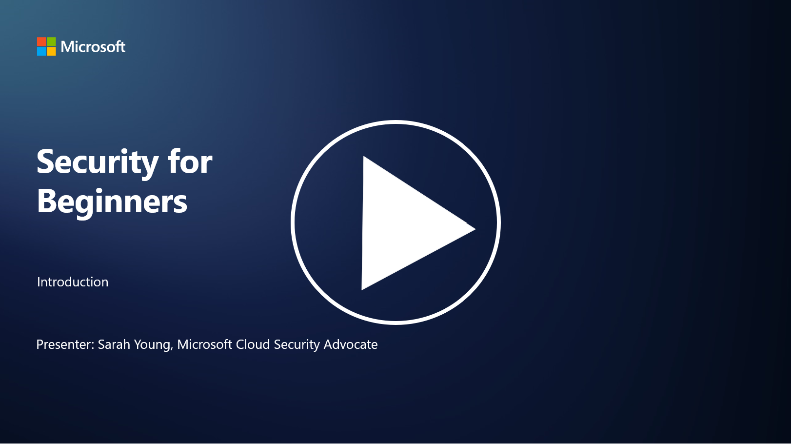

# Uyarı 
Bu repo Microsoft Security-101 reposunun eklemeler, düzenlemeler ve çıkarmalar yapılarak Türkçeye çevirilmiş halidir. Orijinal repoya https://github.com/microsoft/Security-101 adresinden ulaşabilirsiniz.

# 🚀 Yeni Başlayanlar için Siber Güvenlik – Bir Müfredat

Yapay zeka teknolojisinin hızla benimsendiği bu çağda, BT sistemlerini nasıl güvence altına alacağımızı anlamak her zamankinden daha kritik hale geldi. Bu kurs, güvenlik öğreniminize başlamak için temel siber güvenlik kavramlarını öğretmek üzere tasarlanmıştır. Satıcıdan bağımsızdır ve tamamlanması yaklaşık 30-60 dakika süren küçük derslere bölünmüştür. Her dersin sonunda küçük bir test ve konuyu daha derinlemesine incelemek isteyenler için ek okuma bağlantıları bulunmaktadır.

## Bu Kursun Kapsamı 📚

- 🔐 CIA üçlüsü gibi temel siber güvenlik kavramları, riskler, tehditler vb. arasındaki farklar.  
- 🛡️ Güvenlik kontrolünün ne olduğu ve hangi biçimlerde olduğu.  
- 🌐 Sıfır güven (Zero Trust) kavramının modern siber güvenlikte neden önemli olduğu.  
- 🔑 Kimlik, ağ, güvenlik operasyonları, altyapı ve veri güvenliği gibi alanlarda temel kavramlar ve temalar.  
- 🔧 Güvenlik kontrollerini uygulamak için kullanılan araçlara örnekler.  

## Bu Kursun Kapsamadıkları 🙅‍♂️

- 🚫 Belirli güvenlik araçlarının nasıl kullanılacağı.  
- 🚫 "Hackleme" veya red teaming/saldırı güvenliği.  
- 🚫 Belirli uyumluluk standartlarını öğrenmek.  

Video dili ingilizcedir.

Bu kursu tamamladığınızda, Microsoft Learn modüllerimizden bazılarına geçebilirsiniz. Öğreniminize [Microsoft Güvenlik, Uyumluluk ve Kimlik Temelleri](https://learn.microsoft.com/training/paths/describe-concepts-of-security-compliance-identity/?WT.mc_id=academic-96948-sayoung) ile devam etmenizi öneririz. Bu modüllere Türkçe bir şekilde erişebilirsiniz.

Son olarak, [SC-900: Microsoft Güvenlik, Uyumluluk ve Kimlik Temelleri Sınavı](https://learn.microsoft.com/credentials/certifications/exams/sc-900/?WT.mc_id=academic-96948-sayoung)'na girmeyi düşünebilirsiniz.

> 💁 Bu kurs hakkında herhangi bir geri bildiriminiz veya eksik olduğunu düşündüğünüz içerik önerileriniz varsa, sizden haber almak isteriz!

---

## Modül Genel Bakışı 📝

| **Modül Numarası** | **Modül Adı**                           | **Öğretilen Kavramlar**                                                                 | **Öğrenim Hedefleri**                                                                                          |
|-------------------|-------------------------------------------|-----------------------------------------------------------------------------------------|-----------------------------------------------------------------------------------------------------------------|
| **1.1**           | Temel güvenlik kavramları                | [CIA üçlüsü](https://github.com/akinerkisa/Security-101/blob/main/1.1%20CIA%20%C3%9C%C3%A7l%C3%BCs%C3%BC%20ve%20Di%C4%9Fer%20Temel%20Kavramlar.md) | Gizlilik, bütünlük ve erişilebilirlik hakkında bilgi edinin. Ayrıca kimlik doğrulama, inkâr edilemezlik ve gizlilik. |
| **1.2**           | Temel güvenlik kavramları                | [Yaygın siber güvenlik tehditleri](https://github.com/akinerkisa/Security-101/blob/main/1.2%20Yayg%C4%B1n%20Siber%20G%C3%BCvenlik%20Tehditleri.md) | Bireyleri ve organizasyonları etkileyen yaygın siber güvenlik tehditlerini öğrenin.                             |
| **1.3**           | Temel güvenlik kavramları                | [Risk yönetimini anlamak](https://github.com/akinerkisa/Security-101/blob/main/1.3%20Risk%20Y%C3%B6netimini%20Anlamak.md) | Risk değerlendirme ve anlama – etki/olasılık ve kontrollerin uygulanması hakkında bilgi edinin.                 |
| **1.4**           | Temel güvenlik kavramları                | [Güvenlik uygulamaları ve dokümantasyon](https://github.com/akinerkisa/Security-101/blob/main/1.4%20G%C3%BCvenlik%20Uygulamalar%C4%B1%20ve%20Dok%C3%BCmantasyon.md) | Politikalar, prosedürler, standartlar ve düzenlemeler/yasalar arasındaki farkları öğrenin.                       |
| **1.5**           | Temel güvenlik kavramları                | [Sıfır güven](https://github.com/akinerkisa/Security-101/blob/main/1.5%20S%C4%B1f%C4%B1r%20G%C3%BCven%20(Zero%20Trust).md) | Sıfır güvenin ne olduğunu ve mimariyi nasıl etkilediğini öğrenin. Derinlemesine savunma nedir?                   |
| **1.6**           | Temel güvenlik kavramları                | [Paylaşılan sorumluluk modeli](https://github.com/akinerkisa/Security-101/blob/main/1.6%20Payla%C5%9F%C4%B1lan%20Sorumluluk%20Modeli%20(Shared%20Responsibility%20Model).md) | Paylaşılan sorumluluk modelinin ne olduğunu ve siber güvenliği nasıl etkilediğini öğrenin.                      |
| **1.7**           | [Modül sonu testi](https://github.com/akinerkisa/Security-101/blob/main/1.7%20Mod%C3%BCl%20Sonu%20Testi.md) |                                                                                         |                                                                                                                 |
| **2.1**           | Kimlik ve erişim yönetimi temelleri      | [IAM temel kavramları](https://github.com/akinerkisa/Security-101/blob/main/2.1%20IAM%20(Kimlik%20ve%20Eri%C5%9Fim%20Y%C3%B6netimi)%20Temel%20Kavramlar%C4%B1.md) | En az ayrıcalık ilkesi, görev ayrımı ve IAM'nin sıfır güveni nasıl desteklediği hakkında bilgi edinin.          |
| **2.2**           | Kimlik ve erişim yönetimi temelleri      | [IAM sıfır güven mimarisi](https://github.com/akinerkisa/Security-101/blob/main/2.2%20IAM%20ve%20S%C4%B1f%C4%B1r%20G%C3%BCven%20Mimarisi.md) | Kimliğin modern BT ortamlarında yeni sınır olduğunu ve hangi tehditleri azalttığını öğrenin.                    |
| **2.3**           | Kimlik ve erişim yönetimi temelleri      | [IAM yetenekleri](https://github.com/akinerkisa/Security-101/blob/main/2.3%20IAM%20Yetenekleri.md) | Kimlikleri güvence altına almak için IAM yetenekleri ve kontrolleri hakkında bilgi edinin.                      |
| **2.4**           | [Modül sonu testi](https://github.com/akinerkisa/Security-101/blob/main/2.4%20Mod%C3%BCl%20Sonu%20Testi.md) |                                                                                         |                                                                                                                 |
| **3.1**           | Ağ güvenliği temelleri                   | [Ağ güvenliği temel kavramları](https://github.com/akinerkisa/Security-101/blob/main/3.1%20A%C4%9F%20(Network)%20Temel%20Kavramlar%C4%B1.md) | Ağ kavramları (IP adresleme, port numaraları, şifreleme vb.) hakkında bilgi edinin.                             |
| **3.2**           | Ağ güvenliği temelleri                   | [Ağ sıfır güven mimarisi](https://github.com/akinerkisa/Security-101/blob/main/3.2%20A%C4%9F%20ve%20S%C4%B1f%C4%B1r%20G%C3%BCven%20Mimarileri.md) | Ağın uçtan uca sıfır güven mimarisine nasıl katkıda bulunduğunu ve hangi tehditleri azalttığını öğrenin.         |
| **3.3**           | Ağ güvenliği temelleri                   | [Ağ güvenliği yetenekleri](https://github.com/akinerkisa/Security-101/blob/main/3.3%20A%C4%9F%20G%C3%BCvenli%C4%9Fi%20Yetenekleri.md) | Ağ güvenliği araçları – güvenlik duvarları, WAF, DDoS koruması vb. hakkında bilgi edinin.                        |
| **3.4**           | [Modül sonu testi](https://github.com/akinerkisa/Security-101/blob/main/3.4%20Mod%C3%BCl%20Sonu%20Testi) |                                                                                         |                                                                                                                 |
| **4.1**           | Güvenlik operasyonları temelleri         | [SecOps temel kavramları](https://github.com/akinerkisa/Security-101/blob/main/4.1%20SecOps%20(G%C3%BCvenlik%20Operasyonlar%C4%B1)%20Temel%20Kavramlar%C4%B1.md) | Güvenlik operasyonlarının neden önemli olduğunu ve normal BT operasyon ekiplerinden nasıl farklılaştığını öğrenin. |
| **4.2**           | Güvenlik operasyonları temelleri         | [SecOps sıfır güven mimarisi](https://github.com/akinerkisa/Security-101/blob/main/4.2%20SecOps%20ve%20S%C4%B1f%C4%B1r%20G%C3%BCven%20Mimarisi.md) | SecOps'un uçtan uca sıfır güven mimarisine nasıl katkıda bulunduğunu ve hangi tehditleri azalttığını öğrenin.    |
| **4.3**           | Güvenlik operasyonları temelleri         | [SecOps yetenekleri](https://github.com/akinerkisa/Security-101/blob/main/4.3%20SecOps%20Yetenekleri.md) | SecOps araçları – SIEM, XDR vb. hakkında bilgi edinin.                                                          |
| **4.4**           | [Modül sonu testi](https://github.com/akinerkisa/Security-101/blob/main/4.4%20Mod%C3%BCl%20Sonu%20Testi) |                                                                                         |                                                                                                                 |
| **5.1**           | Uygulama güvenliği temelleri             | [AppSec temel kavramları](https://github.com/akinerkisa/Security-101/blob/main/5.1%20AppSec%20(Uygulama%20G%C3%BCvenli%C4%9Fi)%20Temel%20Kavramlar%C4%B1.md) | Tasarımda güvenlik, giriş doğrulama vb. gibi AppSec kavramları hakkında bilgi edinin.                           |
| **5.2**           | Uygulama güvenliği temelleri             | [AppSec yetenekleri](https://github.com/akinerkisa/Security-101/blob/main/5.2%20AppSec%20Yetenekleri.md) | AppSec araçları: boru hattı güvenlik araçları, kod tarama, gizli anahtar tarama vb. hakkında bilgi edinin.       |
| **5.3**           | [Modül sonu testi](https://github.com/akinerkisa/Security-101/blob/main/5.3%20Mod%C3%BCl%20Sonu%20Testi.md) |                                                                                         |                                                                                                                 |
| **6.1**           | Altyapı güvenliği temelleri              | [Altyapı güvenliği temel kavramları](https://github.com/akinerkisa/Security-101/blob/main/6.1%20Altyap%C4%B1%20G%C3%BCvenli%C4%9Finin%20Temel%20Kavramlar%C4%B1.md) | Sistemleri sertleştirme, yamalama, güvenlik hijyeni, konteyner güvenliği hakkında bilgi edinin.                 |
| **6.2**           | Altyapı güvenliği temelleri              | [Altyapı güvenliği yetenekleri](https://github.com/akinerkisa/Security-101/blob/main/6.2%20Altyap%C4%B1%20G%C3%BCvenli%C4%9Fi%20Yetenekleri.md) | Altyapı güvenliğine yardımcı olabilecek araçlar hakkında bilgi edinin, ör. CSPM, konteyner güvenliği vb.         |
| **6.3**           | [Modül sonu testi](https://github.com/akinerkisa/Security-101/blob/main/6.3%20Mod%C3%BCl%20Sonu%20Testi.md) |                                                                                         |                                                                                                                 |
| **7.1**           | Veri güvenliği temelleri                 | [Veri güvenliği temel kavramları](https://github.com/akinerkisa/Security-101/blob/main/7.1%20Veri%20G%C3%BCvenli%C4%9Finin%20Temel%20Kavramlar%C4%B1.md) | Veri sınıflandırması ve saklama ile bunların bir organizasyon için neden önemli olduğu hakkında bilgi edinin.    |
| **7.2**           | Veri güvenliği temelleri                 | [Veri güvenliği yetenekleri](https://github.com/akinerkisa/Security-101/blob/main/7.2%20Veri%20G%C3%BCvenli%C4%9Fi%20Yetenekleri.md) | Veri güvenliği araçları – DLP, iç tehdit yönetimi, veri yönetişimi vb. hakkında bilgi edinin.                    |
| **7.3**           | [Modül sonu testi](https://github.com/akinerkisa/Security-101/blob/main/7.3%20Mod%C3%BCl%20Sonu%20Testi.md) |                                                                                         |                                                                                                                 |
| **8.1**           | Yapay zeka güvenliği temelleri           | [Yapay zeka güvenliği temel kavramları](https://github.com/akinerkisa/Security-101/blob/main/8.1%20Yapay%20Zeka%20G%C3%BCvenli%C4%9Finin%20Temel%20Kavramlar%C4%B1.md) | Geleneksel güvenlik ile yapay zeka güvenliği arasındaki farklar ve benzerlikler hakkında bilgi edinin.           |
| **8.2**           | Yapay zeka güvenliği temelleri           | [Yapay zeka güvenliği yetenekleri](https://github.com/akinerkisa/Security-101/blob/main/8.2%20Yapay%20Zeka%20G%C3%BCvenli%C4%9Fi%20Yetenekleri.md) | Yapay zeka güvenliği araçları ve yapay zekayı güvence altına almak için kullanılabilecek kontroller hakkında bilgi edinin. |
| **8.3**           | Yapay zeka güvenliği temelleri           | [Sorumlu yapay zeka](https://github.com/akinerkisa/Security-101/blob/main/8.3%20Sorumlu%20Yapay%20Zeka) | Sorumlu yapay zekanın ne olduğunu ve güvenlik profesyonellerinin farkında olması gereken yapay zeka kaynaklı zararları öğrenin. |
| **8.4**           | [Modül sonu testi](https://github.com/akinerkisa/Security-101/blob/main/8.4%20Mod%C3%BCl%20Sonu%20Testi.md) |                                                                                         |                                                                                                                 |

---

## 🎒 Diğer Kurslar

Ekibimiz başka kurslar da üretiyor! Şunlara göz atın:

- [Yeni Başlayanlar için Makine Öğrenimi](https://aka.ms/ml-beginners?WT.mc_id=academic-96948-sayoung)  
- [Yeni Başlayanlar için Veri Bilimi](https://aka.ms/datascience-beginners?WT.mc_id=academic-96948-sayoung)  
- [Yeni Başlayanlar için Yapay Zeka](https://aka.ms/ai-beginners?WT.mc_id=academic-96948-sayoung)  
- [Yeni Başlayanlar için Üretken Yapay Zeka](https://github.com/microsoft/generative-ai-for-beginners?WT.mc_id=academic-96948-sayoung)  
- [Yeni Başlayanlar için Web Geliştirme](https://aka.ms/webdev-beginners?WT.mc_id=academic-96948-sayoung)  
- [Yeni Başlayanlar için IoT](https://aka.ms/iot-beginners?WT.mc_id=academic-96948-sayoung)  
- [Yeni Başlayanlar için XR Geliştirme](https://github.com/microsoft/xr-development-for-beginners?WT.mc_id=academic-96948-sayoung)  
- [GitHub Copilot ile Yapay Zeka Eşli Programlama](https://aka.ms/GitHubCopilotAI?WT.mc_id=academic-96948-sayoung)
